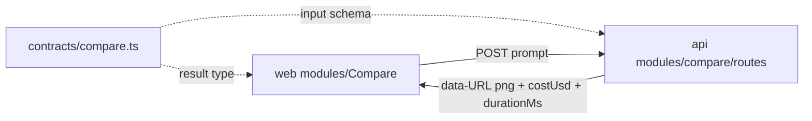

# compare.ts — Compare utility wire contracts

> AI-facing sidecar for `compare.ts`. Created 2026-07-29. Keep this in sync with the code on every change.

## Purpose

Wire-format source of truth for the hidden `/compare` model-evaluation page's
one endpoint, `POST /api/compare/generate`. Shared by `apps/api` (route input
validation) and `apps/web` (typed response) so client and server can never
disagree about the shape.

## What it does (for an AI reader)

- Responsibilities: define the input/result zod schemas + inferred types for
  the compare endpoint. Nothing else — no logic, no I/O.
- Public API / exports: `compareGenerateInputSchema`, `CompareGenerateInput`,
  `compareGenerateResultSchema`, `CompareGenerateResult`.
- Inputs → Outputs: `{ prompt: string (2..2000) }` → `{ imageUrl: string,
  costUsd: number|null, durationMs: int ≥ 0 }`.
- Side effects: none (pure schemas).

## Dependencies

- Imports / depends on: `zod` only.
- Used by: `apps/api/src/modules/compare/routes.ts` (input parse),
  `apps/web/src/modules/Compare/model/providers.ts` (typed response).
  Exported via `packages/contracts/src/index.ts`.

## Diagram

## Key decisions / gotchas

- Prompt bounds mirror `createGenerationInputSchema` on purpose: the page
  evaluates prompts users would really submit through the normal generator.
- `imageUrl` is a **data: URL** (base64 PNG) straight from DeepInfra's
  Qwen-Image-Max — never persisted server-side, never re-fetched (no SSRF
  surface), rendered directly by the SPA.
- `costUsd` is DeepInfra's own `inference_status.cost`; `null` when the
  provider omits it (SPA hides the cost chip then).
- No `costCredits` here by design: the endpoint spends operator provider USD,
  not user credits — it never touches the ledger.

## Commits

- c5fe185 feat(compare): скрытая страница /compare — FLUX dev vs Nano Banana Pro vs Qwen Image Max
