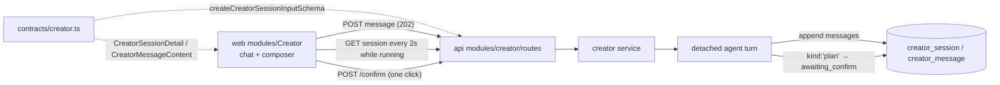

# creator.ts — openCreator agent chat wire contracts

> AI-facing sidecar for `creator.ts`. Created 2026-07-30. Keep this in sync with the code on every change.

## Purpose

Wire-format source of truth for openCreator (ADR
`docs/wiki/decisions/opencreator-agent.md`): the `/creator` chat where a user
states a task («сделай ролик про лиса») and a server-side agent writes the
scenario, builds the artifacts and — after ONE budget confirmation — runs the
generations. A session is a persisted chat and **every agent step is a message**,
so the SPA re-renders the whole story from one GET and a page reload loses
nothing (ADR D4).

Like `canvas.ts` and `film.ts`, nothing here carries money, media bytes or
provider state: a message only CITES a canvas / entity / generation by id.

## What it does (for an AI reader)

- Responsibilities: define the zod schemas + inferred types for creator sessions,
  their messages, and the two request bodies. No logic, no I/O.
- Public API / exports:
  - `creatorSessionStatusSchema` / `CreatorSessionStatus` — `idle` · `running` ·
    `awaiting_confirm` · `failed`. The SPA's poll predicate reads this.
  - `creatorMessageContentSchema` / `CreatorMessageContent` — discriminated union
    on `kind`: `text` · `step` · `plan` · `result`.
  - `creatorMessageSchema` / `CreatorMessage` — `{ id, role, content, createdAt }`.
  - `creatorSessionSchema` / `CreatorSession` (list row),
    `creatorSessionDetailSchema` / `CreatorSessionDetail` (row + messages),
    `creatorSessionListSchema` / `CreatorSessionList`.
  - `createCreatorSessionInputSchema` / `CreateCreatorSessionInput`,
    `postCreatorMessageInputSchema` / `PostCreatorMessageInput` (the same shape —
    opening a session and continuing it both carry one `message`).
- Inputs → Outputs:
  - `POST /api/creator/sessions` ← `{ message }` → 202 `CreatorSessionDetail`
  - `GET /api/creator/sessions` → `CreatorSessionList`
  - `GET /api/creator/sessions/:id` → `CreatorSessionDetail` (the 2s SPA poll)
  - `POST /api/creator/sessions/:id/messages` ← `{ message }` → 202 `CreatorSessionDetail`
  - `POST /api/creator/sessions/:id/confirm` → 202 `CreatorSessionDetail`
- Side effects: none (pure schemas).

## Dependencies

- Imports / depends on: `zod` only.
- Used by: `apps/api/src/modules/creator/routes.ts` (input parse),
  `apps/api/src/modules/creator/service.ts` (message content is stored as
  `content_json` and parsed back through this union),
  `apps/web/src/modules/Creator/*` (typed API + card rendering).
  Exported via `packages/contracts/src/index.ts`.

## Diagram

## Key decisions / gotchas

- **`plan` is the budget gate, and it is a message — not a route flag.** The card
  the user confirms is an ordinary assistant message with itemized credits, so the
  gate survives a reload and is auditable after the fact. The ENFORCEMENT lives in
  code (`modules/creator/tools.ts` refuses `start_generation` while the session's
  `confirmed` flag is 0), never in this schema and never in the prompt.
- **`step` carries ids, not payloads.** One executed tool → one card. The
  optional `canvasId` / `entityId` / `generationId` are what let a card link the
  artifact it produced; the media itself is fetched through the existing
  generation/canvas endpoints, so an agent step never duplicates state.
- **`status` on a step is `done | error` only.** A tool executes synchronously
  inside one turn, so there is no in-flight step to render — and an errored tool
  is DATA the agent read and reacted to, not a failed request. A `running` value
  would imply per-step polling the loop does not do.
- **Credits are `int().min(0)`.** A plan can never propose a negative charge; the
  only thing that spends is `generationService.create()` through the ordinary
  charge path.
- **Bounds mirror the rest of the product.** `message` is `min(2).max(2000)` —
  the same bounds as a generation prompt, because it is the same kind of user
  text. `text` content is capped at 4000 (the agent's prose can be longer than a
  prompt), `items` at 40 (a plan longer than that is a runaway loop, not a plan).
- **`role` is `user | assistant` only** — deliberately narrower than the ADR's
  sketch (`user | assistant | tool`). Tool results never become chat messages:
  full tool fidelity lives INSIDE one turn's transcript, and what the user sees is
  the `step` card the loop writes. A `tool` role would leak raw JSON into the chat
  and double-log every action.
- **`postCreatorMessageInputSchema` is an alias, not a copy.** Opening a session
  and continuing it are the same act (one instruction), so a divergence here would
  be a bug rather than a feature.

## Commits

- 0e16d98 feat(creator): wire contracts for the agent chat
