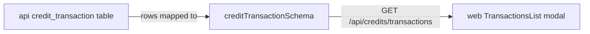

# credits.ts — AI component doc

> AI-facing sidecar for `credits.ts`. Created 2026-07-06. Keep this in sync with the code on every change.

## Purpose
Contracts for the credit ledger rows exposed by `GET /api/credits/transactions`: signed amounts + a closed kind enum implementing the ADR's hold→settle/refund semantics collapsed to `charge`/`refund` (+ `signup_bonus`).

## What it does (for an AI reader)
- Responsibilities: define one ledger transaction (`id`, signed integer `amount`, `kind`, nullable `generationId`, ISO `createdAt`) and the list envelope `{ items }`.
- Public API / exports: `creditTransactionKindSchema`, `creditTransactionSchema`/`CreditTransaction`, `creditTransactionListSchema`.
- Inputs → Outputs: unknown JSON → typed transaction rows.
- Side effects: none (pure schemas).

## Dependencies
- Imports / depends on: `zod`.
- Used by: `apps/api` `modules/credits/routes.ts` (response shape), `apps/web` Credits module `TransactionsList` (colors by sign, labels by kind via i18n).

## Diagram

## Key decisions / gotchas
- Amounts are SIGNED: `charge` rows negative, `refund`/`signup_bonus` positive — the ledger sums to the user's balance; the UI must not apply its own sign.
- `generationId` is null for `signup_bonus`, set for `charge`/`refund`; refund-once invariant enforced API-side.

## Commits
- _no commit yet_
