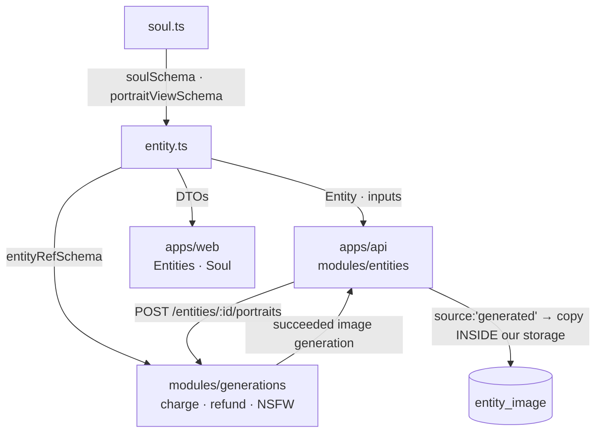

# entity.ts — the entity library + the structured mention channel

> AI-facing sidecar for `entity.ts`. **ADRs:** `entity-library-reference-tagging.md`, `ai-soul-studio.md`

## Purpose

A reusable subject — a **character, object or place** — that a user can *tag inside a prompt* so the
model renders **that** subject and not a plausible stranger. This file is the wire format for the
library, for the tag protocol, and (since Soul Studio) for a character's structured `soul`.

## What it does (for an AI reader)

- **Responsibilities:** define the `Entity` DTO, its images, the create/update/add-image inputs, and
  the `[[e1]]` placeholder protocol that makes tagging work at all.
- **Side effects:** none — schemas and one pure helper.

### Public API

| Export | Role |
|---|---|
| `entityKindSchema` | `character \| object \| place \| other` |
| `entityImageSourceSchema` | `upload \| library \| **generated**` — `generated` is a Soul Studio portrait the entity paid for |
| `entityImageSchema` | `{ id, url, source, view, createdAt }` — `view` is the reference-sheet slot (or null) |
| `entitySchema` | `{ id, kind, name, description, **soul**, images, primaryImageId, … }` |
| `createEntityInputSchema` / `updateEntityInputSchema` | both accept an optional `soul` |
| `addEntityImageInputSchema` | a **union**: `{ source:'upload'\|'library', dataUri }` **or** `{ source:'generated', generationId, view }` |
| `createPortraitsInputSchema` / `portraitsResponseSchema` | `POST /api/entities/:id/portraits` — the reference-sheet mint |
| `ENTITY_PLACEHOLDER_PATTERN`, `entityPlaceholderToken()`, `entityRefSchema` | the tag protocol |

### Inputs → outputs

```
client prompt "…[[e1]] on a rooftop"  +  entityRefs [{ e1, entityId }]
        └─ API: mentions.composePrompt ─▶ "…Аня (a woman, iron arm) on a rooftop"  ─▶ the model
Soul (constructor)  ─ API: composeSoul ─▶ entity.description   (DERIVED — see invariant)
```

## Dependencies

- **Imports:** `zod`; `soulSchema` + `portraitViewSchema` from `./soul`.
- **Used by:** `apps/api/src/modules/entities/*` (service, routes, mentions, portraits) ·
  `apps/api/src/modules/generations/service.ts` (re-validates refs before charging) ·
  `apps/web/src/modules/Entities/*` and `apps/web/src/modules/Soul/*`.

## Diagram



## Key decisions / gotchas

- **A tag is STRUCTURE, never prose.** A text encoder reads `@аня` as the word "аня" — there is no
  lookup. So the prompt carries opaque `[[e1]]` placeholders and `entityRefs` carries the meaning.
  If tags lived in the prompt string the user would tag a character, pay credits, and receive a
  stranger — silently and totally.
- **INVARIANT: `soul != null ⟹ description is DERIVED.**` The service overwrites `description` with
  `composeSoul(soul)` on every soul change and *ignores* a client-sent description — there is nothing
  the client could send that would be right, because a constructor cannot round-trip prose.
  `soul.notes` is the escape hatch, appended verbatim.
- **`soul` is an additive column on `entity`, not a new table.** A soul-built character *is* an
  entity: it inherits ownership, soft-delete and the `[[e1]]` protocol for free, and it drops
  straight into the Generator and CinemaStudio the moment it exists. A separate `character` table
  would have forked all four.
- **`addEntityImageInput` is a union, not one loose object.** The two branches have disjoint required
  fields; a schema accepting `{ source:'generated' }` with no `generationId` is a 500 waiting to
  happen. The upload branch **defaults** its `source`, so the pre-existing `{ dataUri }` call the
  entity editor already makes still parses unchanged.
- **`generated` transfers an id, not bytes.** The API copies the asset *inside our own storage* by
  `generationId` after checking the generation is the caller's, succeeded, and an image. It never
  fetches a client-supplied URL (SSRF guard), and it never trusts a provider URL (Runware assets
  expire in 7 days — an entity pointing at one silently breaks a week later).
- **`view` makes a re-roll a REPLACE.** Attaching a view the entity already has swaps that image
  instead of appending a fifth one nobody asked for.

## Commits

- _pending_ — `feat(contracts): soul on entity, generated portraits, reference-sheet views`
