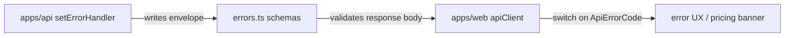

# errors.ts — AI component doc

> AI-facing sidecar for `errors.ts`. Created 2026-07-06. Keep this in sync with the code on every change.

## Purpose
Defines the shared API error envelope: every non-2xx response from `apps/api` is `{ error: { code, message } }` with `code` drawn from a closed enum, so clients branch on codes, not message strings.

## What it does (for an AI reader)
- Responsibilities: single source of truth for the error-code taxonomy (`unauthorized`, `not_found`, `validation_failed`, `insufficient_credits`, `content_blocked`, `provider_error`, `rate_limited`, `conflict`, `internal_error`) and the envelope shape.
- Public API / exports: `apiErrorCodeSchema`, `ApiErrorCode`, `apiErrorSchema`, `ApiError`.
- Inputs → Outputs: unknown JSON → validated `{ error: { code, message } }` via `safeParse`.
- Side effects: none (pure Zod schema definitions).

## Dependencies
- Imports / depends on: `zod`.
- Used by: `apps/api` error handler (builds envelopes), `apps/web` `shared/libs/apiClient.ts` (parses envelopes into `ApiClientError`), re-exported by `src/index.ts`.

## Diagram

## Key decisions / gotchas
- Closed enum on purpose: adding a code is a contract change both sides must see, never an ad-hoc string.
- `insufficient_credits` maps to HTTP 402 in the API; the web Generator shows an inline banner with a /pricing link for it.
- `rate_limited` (ops hardening) maps to HTTP 429 from `@fastify/rate-limit` (strict buckets on `/api/auth/*` and `POST /api/generations`, global default elsewhere) — a stable code so the SPA can show a dedicated "slow down" message.
- `conflict` (money-path review) maps to HTTP 409: the request is valid but the resource's current state forbids it — today only DELETE of a still-processing generation (deleting mid-flight would forfeit the refund and orphan the Runware task). Additive change; the web client consumes `ApiErrorCode` as a type, so existing switches keep compiling.

## Commits
- 5c5d863 feat(contracts): shared zod schemas for catalog, generations, credits, user, errors
- cdd94a3 feat(api): sanitized errors + rate limits — rate_limited added to the code enum
- 2859858 fix(api): forbid deleting processing generations — conflict (409) added to the code enum
