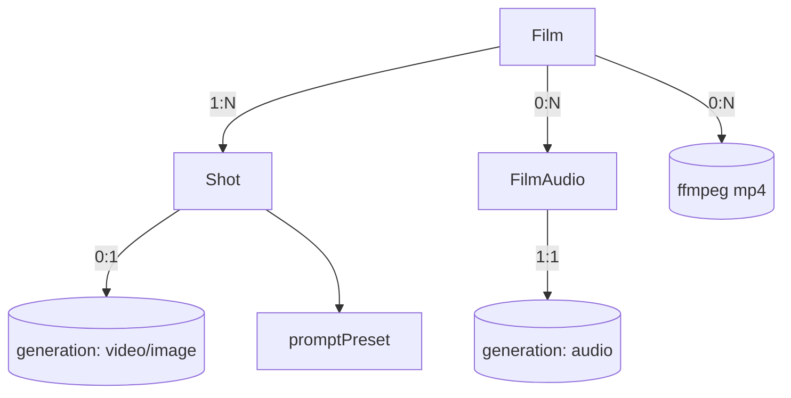

# film.ts — AI component doc

> AI-facing sidecar for `film.ts`. Created 2026-07-09. Keep this in sync with the code on every change.

## Purpose
Wire contracts for CinemaStudio: `Film`, `Shot`, `FilmAudio`, `FilmRender` DTOs plus their
create/update/reorder inputs. The composition layer that sits over generations. ADR:
`docs/wiki/decisions/cinema-studio.md`.

## What it does (for an AI reader)
- Responsibilities: define the shapes shared by API and web for films and their timeline.
- Public API / exports:
  - `filmSchema`/`Film`, `createFilmInputSchema`, `updateFilmInputSchema`.
  - `shotSchema`/`Shot`, `createShotInputSchema`, `updateShotInputSchema`, `reorderShotsInputSchema`,
    plus `transitionSchema`, `titlePositionSchema`, `shotTitleSchema`.
  - `filmAudioSchema`/`FilmAudio`, `audioKindSchema`, `addFilmAudioInputSchema`.
  - `filmRenderSchema`/`FilmRender`, `renderStatusSchema`.
  - Composite reads: `filmDetailSchema` (film + ordered shots + audio), `filmListSchema`.
- Inputs → Outputs: pure schema/type definitions; no runtime behaviour.
- Side effects: none.

## Dependencies
- Imports / depends on: `zod`, `./catalog` (aspectRatioSchema), `./presets` (promptPresetSchema, styleIdSchema).
- Used by (planned): `index.ts` re-export; API `modules/films/*` (service + routes + render);
  web `modules/Cinema/*`.

## Diagram

## Key decisions / gotchas
- `shot.generationId` nullable → a title-card shot has no footage; rendered for `durationMs` over a
  solid background.
- Durations are milliseconds (timeline unit); the render converts to ffmpeg seconds. Video shot plays
  `[trimStartMs, trimStartMs+durationMs)`.
- `orderIndex` is a real number; the client never sets it — reorder sends an ORDERED id list and the
  service reassigns spaced values (no whole-list renumber collisions).
- `FilmRender` has NO `costCredits`/refund — it spends our CPU, not a provider invoice. Same status
  SHAPE as a generation, different economics.

## Update 2026-07-15 — native generation audio
- `shotSchema` += `audio: boolean` (required on the wire; service defaults
  false) — generate this shot's clip WITH the model's own soundtrack and carry
  it into the export mix. `createShotInputSchema`/`updateShotInputSchema` +=
  optional `audio`.

## Commits
- _no commit yet_

## Update 2026-07-09 — storyboard
- Added `createStoryboardInputSchema`/`CreateStoryboardInput` (`{ script, styleId?, shotCount? }`), and the LLM-output guards `storyboardShotSchema`/`StoryboardShot` + `storyboardResponseSchema` (`{ shots: [...] }`). Now also imports `cameraShotSchema`/`cameraMotionSchema` from presets. Storyboard shots become DRAFT shots (generationId null) — nothing is generated or charged until the user presses Generate per shot.

## Update 2026-07-11 — template catalog (ADR: `docs/wiki/decisions/template-catalog.md`)
Four additive fields, all nullable, all readable as "the same wire as before" by a legacy client.

- **`shot.modelId: string | null`** — the catalog model this shot generates with. `null` = "no
  opinion" → the composer falls back to the shot's style recommendation, then to the first video
  model. *Why it now exists*: the model used to be TRANSIENT state inside the shot inspector — it
  defaulted to `videoModels[0]` on every mount, so re-selecting a shot silently forgot which model
  produced its clip and a re-Generate could come back on a different model at a different price.
  Persisting it fixes that AND is what lets a template pin a tier ("this eight-beat drama runs on
  veo-3-1-fast" is a per-shot fact, and there was nowhere to write it down). Also added to
  `createShotInputSchema` (`.max(80)`), validated against the live catalog by the service rather than
  enum'd here — model ids are catalog data, not wire constants.
- **`shot.voiceover: { text (1–600), voice (1–80) } | null`** (`shotVoiceoverSchema`/`ShotVoiceover`) —
  the line this shot's character SPEAKS. **Authored copy, not a generated asset**: holding it costs
  nothing, and it is the script the user edits before spending credits to hear it. It exists because
  `FilmAudio` requires a `generationId`, so a track cannot exist as a draft — a template had no way to
  hand the user "here is what the strawberry says in beat 4" without generating (and charging for) the
  TTS up front. **It is NOT a lipsync contract**: no model in the catalog does lipsync; the mouth
  movement is whatever the video model hallucinates, and the voice is mixed under it by ffmpeg at
  render. (`veo-3-1-fast` can speak natively from the prompt itself — that is why the premium tier
  exists.) `voice` is a plain string, not an enum: the list is catalog data that changes with the
  provider, so the API validates it against the live catalog.
- **`film.templateId: string | null`** — provenance. **Read-only from the client's side**: there is no
  way to set it via `createFilmInput` (deliberately absent there — "a film's template provenance is a
  fact the SERVER establishes, not a claim the client may assert"); only `POST /films/from-template`
  stamps it. Two things read it back: the audio panel (to pre-fill the music prompt the template
  authored) and analytics ("which templates get finished?").
- **`filmAudio.shotId: string | null`** — the shot this track voices; `null` = a film-wide bed (music,
  or a voiceover the user placed by hand). It exists to make "voice this shot" SAFE: without it the
  editor cannot tell whether a shot has already been voiced, so a second click on Generate would
  quietly add a second overlapping track — and charge for it again. With it the action is a REPLACE,
  the button can honestly read "Re-voice", and the track list can say WHICH beat a line belongs to.
  Also added to `addFilmAudioInputSchema`.
