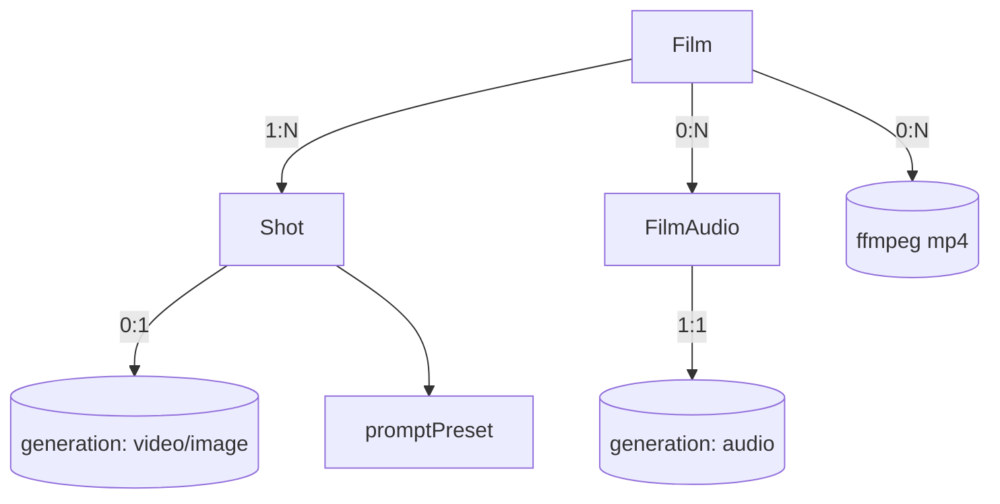

# film.ts — AI component doc

> AI-facing sidecar for `film.ts`. Created 2026-07-09. Keep this in sync with the code on every change.

## Purpose
Wire contracts for CinemaStudio: `Film`, `Shot`, `FilmAudio`, `FilmRender` DTOs plus their
create/update/reorder inputs. The composition layer that sits over generations. ADR:
`docs/wiki/decisions/cinema-studio.md`.

## What it does (for an AI reader)
- Responsibilities: define the shapes shared by API and web for films and their timeline.
- Public API / exports:
  - `filmSchema`/`Film`, `createFilmInputSchema`, `updateFilmInputSchema`.
  - `shotSchema`/`Shot`, `createShotInputSchema`, `updateShotInputSchema`, `reorderShotsInputSchema`,
    `splitShotInputSchema`/`SplitShotInput`, plus `transitionSchema`, `titlePositionSchema`, `shotTitleSchema`.
  - Shot references (attach arbitrary images to a shot): `MAX_SHOT_REFERENCE_IMAGES`,
    `shotReferenceImageSchema`/`ShotReferenceImage`, `addShotReferenceInputSchema`/`AddShotReferenceInput`,
    `generateShotClipInputSchema`/`GenerateShotClipInput`.
  - `filmAudioSchema`/`FilmAudio`, `audioKindSchema`, `addFilmAudioInputSchema`.
  - `filmRenderSchema`/`FilmRender`, `renderStatusSchema`.
  - Composite reads: `filmDetailSchema` (film + ordered shots + audio), `filmListSchema`.
- Inputs → Outputs: pure schema/type definitions; no runtime behaviour.
- Side effects: none.

## Dependencies
- Imports / depends on: `zod`, `./catalog` (aspectRatioSchema), `./entity` (entityRefSchema),
  `./generation` (createGenerationInputSchema — the clip input extends it), `./presets`
  (promptPresetSchema, styleIdSchema, cameraShotSchema, cameraMotionSchema).
- Used by (planned): `index.ts` re-export; API `modules/films/*` (service + routes + render);
  web `modules/Cinema/*`.

## Diagram

## Key decisions / gotchas
- `shot.generationId` nullable → a title-card shot has no footage; rendered for `durationMs` over a
  solid background.
- Durations are milliseconds (timeline unit); the render converts to ffmpeg seconds. Video shot plays
  `[trimStartMs, trimStartMs+durationMs)`.
- `orderIndex` is a real number; the client never sets it — reorder sends an ORDERED id list and the
  service reassigns spaced values (no whole-list renumber collisions).
- `FilmRender` has NO `costCredits`/refund — it spends our CPU, not a provider invoice. Same status
  SHAPE as a generation, different economics.

## Update 2026-07-15 — native generation audio
- `shotSchema` += `audio: boolean` (required on the wire; service defaults
  false) — generate this shot's clip WITH the model's own soundtrack and carry
  it into the export mix. `createShotInputSchema`/`updateShotInputSchema` +=
  optional `audio`.

## Update 2026-07-21 (later) — render block reasons

`renderBlockReasonSchema` (10 members) + `renderBlockSubjectSchema` (`shot|audio|film`)
say WHY an export was refused before ffmpeg ran, and about what.

A refusal is not a failed render: nothing was encoded, so "the render didn't finish, try
again" describes something that never began. The ten causes reduce to three user actions —
WAIT (still generating), REGENERATE (failed / media gone), REMOVE (can never work) — and
one code per cause is what lets the client say which.

**Why here and not `errors.ts`:** `apiErrorCodeSchema` is the app-wide HTTP taxonomy.
Widening it with Cinema domain detail would force every app's exhaustive code→copy map
(`shared/libs/errorCopy.ts`) to carry a render string.

**Two members per throw site are SPLITS.** `shot_clip_processing`/`shot_clip_failed` and
`audio_processing`/`audio_failed` used to share one `status !== 'succeeded'` branch and one
hedging sentence ("remove it or wait for it"). Telling a user to wait for something that
already failed is the bug those splits fix.

## Update 2026-07-21 — shot reference images (attach any image to a shot)

The owner wants to attach arbitrary images (not only tagged Entities) directly to a shot's
prompt area, and have them SURVIVE a re-generate. Three additions:

- **`shotSchema.referenceImages: ShotReferenceImage[]`** — the attached images, as
  `{ id, path }` server media paths (NEVER data URIs on the read DTO — handing bytes back
  inline would bloat every film-detail payload and re-open a channel the wire does not
  carry). Required array, never null, exactly like `entityRefs`. This is what makes an
  attachment PERSIST: it lives on the shot, so a re-generate re-sends it.
- **`addShotReferenceInputSchema`** (`{ dataUri }`) — the upload boundary. `data:image/*`,
  cap 14MB (mirrors the entity image cap), and svg REJECTED (script carrier → stored XSS).
  The storage layer (`parseImageDataUri`) re-rejects svg on the disk side; this rejects it
  first so a bad upload is a clean 400.
- **`generateShotClipInputSchema`** — the delivery seam's body: `createGenerationInputSchema`
  with `entityRefs` widened to `MAX_SHOT_REFERENCE_IMAGES` (the wire /generations schema caps
  at 1; a shot's cast is up to 5). A client-supplied `referenceImages` key is STRIPPED — the
  raw reference-image data-URI channel stays server-only. The server reads the shot's ATTACHED
  images from storage and folds them into that closed channel at generation time.
- **`MAX_SHOT_REFERENCE_IMAGES = 5`** — the shared budget (entity tags + attached images) any
  reference-capable video model accepts (Wan 2.7 r2v). The upload route enforces it so the
  composer's "5/5" counter is truth; the per-generation gate does the model-specific final check.
  `createShotInputSchema.entityRefs` now caps on this constant instead of a bare `5`.

## Update 2026-07-22 — split a shot at a point (`splitShotInputSchema`)

`splitShotInputSchema` (`{ atMs: number().int().positive() }`) is the body of
`POST /api/films/:id/shots/:shotId/split` — the NLE's split-at-playhead.

**The endpoint exists because the operation, while composable client-side, is not
atomic.** Splitting is three writes — shorten shot A, add shot B citing the same
generation with a shifted trim window, reorder B after A — and a mid-sequence
failure leaves a half-split film. One server call in one db transaction makes it
whole-or-nothing.

**Why the schema only checks the LOWER bound.** `atMs` is the split offset from the
shot's OWN start, and the real invariant is `0 < atMs < durationMs`. The schema can
enforce `> 0` (a positive integer millisecond) but NOT `< durationMs` — it has no
access to the shot being split. The upper bound is a service rule
(`films/shot-split.ts`), which throws `FilmValidationError` → the same 400
`validation_failed` the wire lower bound produces. One invariant, checked at the two
layers that can each see half of it.

Consumers: `films/routes.ts` (parses the body on the split route), `films/shot-split.ts`
(the service that enforces the upper bound and performs the transactional split and
returns the updated `FilmDetail`).

## Commits
- dce20de feat(generation): inputGenerationId — canvas chain edge, exclusive with inputImage

## Update 2026-07-09 — storyboard
- Added `createStoryboardInputSchema`/`CreateStoryboardInput` (`{ script, styleId?, shotCount? }`), and the LLM-output guards `storyboardShotSchema`/`StoryboardShot` + `storyboardResponseSchema` (`{ shots: [...] }`). Now also imports `cameraShotSchema`/`cameraMotionSchema` from presets. Storyboard shots become DRAFT shots (generationId null) — nothing is generated or charged until the user presses Generate per shot.

## Update 2026-07-11 — template catalog (ADR: `docs/wiki/decisions/template-catalog.md`)
Four additive fields, all nullable, all readable as "the same wire as before" by a legacy client.

- **`shot.modelId: string | null`** — the catalog model this shot generates with. `null` = "no
  opinion" → the composer falls back to the shot's style recommendation, then to the first video
  model. *Why it now exists*: the model used to be TRANSIENT state inside the shot inspector — it
  defaulted to `videoModels[0]` on every mount, so re-selecting a shot silently forgot which model
  produced its clip and a re-Generate could come back on a different model at a different price.
  Persisting it fixes that AND is what lets a template pin a tier ("this eight-beat drama runs on
  veo-3-1-fast" is a per-shot fact, and there was nowhere to write it down). Also added to
  `createShotInputSchema` (`.max(80)`), validated against the live catalog by the service rather than
  enum'd here — model ids are catalog data, not wire constants.
- **`shot.voiceover: { text (1–600), voice (1–80) } | null`** (`shotVoiceoverSchema`/`ShotVoiceover`) —
  the line this shot's character SPEAKS. **Authored copy, not a generated asset**: holding it costs
  nothing, and it is the script the user edits before spending credits to hear it. It exists because
  `FilmAudio` requires a `generationId`, so a track cannot exist as a draft — a template had no way to
  hand the user "here is what the strawberry says in beat 4" without generating (and charging for) the
  TTS up front. **It is NOT a lipsync contract**: no model in the catalog does lipsync; the mouth
  movement is whatever the video model hallucinates, and the voice is mixed under it by ffmpeg at
  render. (`veo-3-1-fast` can speak natively from the prompt itself — that is why the premium tier
  exists.) `voice` is a plain string, not an enum: the list is catalog data that changes with the
  provider, so the API validates it against the live catalog.
- **`film.templateId: string | null`** — provenance. **Read-only from the client's side**: there is no
  way to set it via `createFilmInput` (deliberately absent there — "a film's template provenance is a
  fact the SERVER establishes, not a claim the client may assert"); only `POST /films/from-template`
  stamps it. Two things read it back: the audio panel (to pre-fill the music prompt the template
  authored) and analytics ("which templates get finished?").
- **`filmAudio.shotId: string | null`** — the shot this track voices; `null` = a film-wide bed (music,
  or a voiceover the user placed by hand). It exists to make "voice this shot" SAFE: without it the
  editor cannot tell whether a shot has already been voiced, so a second click on Generate would
  quietly add a second overlapping track — and charge for it again. With it the action is a REPLACE,
  the button can honestly read "Re-voice", and the track list can say WHICH beat a line belongs to.
  Also added to `addFilmAudioInputSchema`.

## Update 2026-07-21 — `filmDetailSchema.latestRender`

`filmDetailSchema` gains `latestRender: filmRenderSchema.nullable()` — the film's
most recent export, or `null` if it has never been exported.

**Why on the DETAIL rather than a list route.** It answers exactly one question
the editor asks on every mount: "what happened to my export?". A list route would
be more surface (a second query, its own four UI states) for less — the editor
wants the current/last render, not history.

**The bug it closes.** The render id previously lived only in React state, and
nothing on the wire carried it. So a reload lost a running export outright: the
status strip vanished, the ⋯ menu re-offered Export (starting a SECOND ffmpeg job
on the same film), and a finished mp4 became unreachable from the UI even though
the file was sitting on disk. A render outlives the tab that started it, so its
handle has to come back with the film.

**Nullable, not optional.** "Never exported" is a real first-class state the UI
renders differently from "not loaded yet"; an optional field would blur the two.

Consumers: `getFilm` (API) fills it from the newest `film_render` row by
`createdAt`; `FilmEditor` (web) resolves `startedId ?? latestRender?.id` as the
render to poll and to gate the Export menu item on.

## Update 2026-07-30 — `generateShotClipInputSchema` builds on the generation BASE schema

`generation.ts` now splits its wire input into `createGenerationInputBaseSchema`
(the plain object) and `createGenerationInputSchema` (that object plus a
`superRefine` enforcing `inputImage` XOR `inputGenerationId`, the Canvas Mode
chain edge — ADR canvas-mode D2).

`generateShotClipInputSchema` extends the **base**. The exclusivity rule guards
`inputGenerationId`, which the shot-clip path can never carry: a shot's input
images are its OWN attached references, read from storage server-side inside the
route (that is the whole point of this schema — see the block comment above it).
Inheriting a check that can never fire would only mislead the next reader.

Nothing about the shape changed: the same fields, the same `entityRefs` widening
to `MAX_SHOT_REFERENCE_IMAGES`, the same stripping of a hand-rolled
`referenceImages` key.

## Update 2026-07-31 — film cover + the create dialog collapses to "title + picture"

Owner request: creating a film should ask for a **name and, optionally, a cover** — nothing else.
Aspect ratio and default style did not disappear, they moved to the detail page's settings, where
they are decisions about a film you are already looking at.

- **`filmSchema.coverUrl: z.string().nullable()`** — the `/media/<uuid>.<ext>` path of an uploaded
  cover, or null. Nullable and **never absent**: `FilmCard` chooses between the picture and its
  placeholder plate off `coverUrl === null`, so a missing key would mean "the server forgot", not
  "this film has no cover". Every film predating the column reads null, which is what it is. Reaches
  the list and the detail for free — both are built from `filmSchema`.
  Until now a film had **no cover anywhere in the system**; `FilmCard.tsx` said so in a comment.
- **`createFilmInputSchema.aspectRatio` is now optional**, and is defaulted **by the server**
  (`'16:9'`), not by `.default()` here. One side owns that decision, and it is the side that owns
  the row — a schema default would put an opinion in the client bundle too, which is how the two
  come to disagree.
- **`createFilmInputSchema.coverDataUri`** — the cover as BYTES on the create request. It rides the
  create body rather than a follow-up upload so "name it and pick a picture" is ONE request: a second
  round trip can half-succeed and leave a film whose cover silently never arrived. The server stores
  the bytes **before** inserting the row, so a rejected image means no film at all rather than a film
  with a broken cover.
- **Both changes are WIDENING.** Every body an older client sends still parses, and the from-template
  path that has always supplied a ratio is untouched — the only reason this ships without a version
  bump. Pinned by a test that sends the old full body and one that sends a bare title.
- **`rasterImageDataUriSchema` extracted** (top of file, above its first use — `const` is not
  hoisted). One named rule now serves `addShotReferenceInputSchema` and `coverDataUri`, because it is
  a SECURITY boundary: two copies of an svg refusal are two things that can drift, and the one that
  drifts is the one nobody re-reads. `contracts/style.ts` still carries a third copy for a style's
  reference — folding that in would make `style.ts` import from `film.ts` and invert a sensible
  dependency, so it is **flagged, not done**.
- Scope: **create only**. There is deliberately no cover on `updateFilmInputSchema` — changing a
  cover after the fact was not asked for (noted as a possible follow-up).
