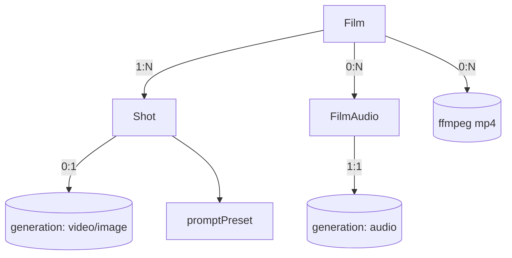

# film.ts — AI component doc

> AI-facing sidecar for `film.ts`. Created 2026-07-09. Keep this in sync with the code on every change.

## Purpose
Wire contracts for CinemaStudio: `Film`, `Shot`, `FilmAudio`, `FilmRender` DTOs plus their
create/update/reorder inputs. The composition layer that sits over generations. ADR:
`docs/wiki/decisions/cinema-studio.md`.

## What it does (for an AI reader)
- Responsibilities: define the shapes shared by API and web for films and their timeline.
- Public API / exports:
  - `filmSchema`/`Film`, `createFilmInputSchema`, `updateFilmInputSchema`.
  - `shotSchema`/`Shot`, `createShotInputSchema`, `updateShotInputSchema`, `reorderShotsInputSchema`,
    plus `transitionSchema`, `titlePositionSchema`, `shotTitleSchema`.
  - `filmAudioSchema`/`FilmAudio`, `audioKindSchema`, `addFilmAudioInputSchema`.
  - `filmRenderSchema`/`FilmRender`, `renderStatusSchema`.
  - Composite reads: `filmDetailSchema` (film + ordered shots + audio), `filmListSchema`.
- Inputs → Outputs: pure schema/type definitions; no runtime behaviour.
- Side effects: none.

## Dependencies
- Imports / depends on: `zod`, `./catalog` (aspectRatioSchema), `./presets` (promptPresetSchema, styleIdSchema).
- Used by (planned): `index.ts` re-export; API `modules/films/*` (service + routes + render);
  web `modules/Cinema/*`.

## Diagram

## Key decisions / gotchas
- `shot.generationId` nullable → a title-card shot has no footage; rendered for `durationMs` over a
  solid background.
- Durations are milliseconds (timeline unit); the render converts to ffmpeg seconds. Video shot plays
  `[trimStartMs, trimStartMs+durationMs)`.
- `orderIndex` is a real number; the client never sets it — reorder sends an ORDERED id list and the
  service reassigns spaced values (no whole-list renumber collisions).
- `FilmRender` has NO `costCredits`/refund — it spends our CPU, not a provider invoice. Same status
  SHAPE as a generation, different economics.

## Commits
- _no commit yet_

## Update 2026-07-09 — storyboard
- Added `createStoryboardInputSchema`/`CreateStoryboardInput` (`{ script, styleId?, shotCount? }`), and the LLM-output guards `storyboardShotSchema`/`StoryboardShot` + `storyboardResponseSchema` (`{ shots: [...] }`). Now also imports `cameraShotSchema`/`cameraMotionSchema` from presets. Storyboard shots become DRAFT shots (generationId null) — nothing is generated or charged until the user presses Generate per shot.
