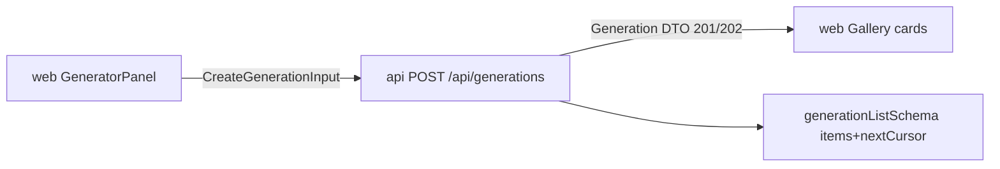

# generation.ts — AI component doc

> AI-facing sidecar for `generation.ts`. Created 2026-07-06. Keep this in sync with the code on every change.

## Purpose
Contracts for the generation lifecycle: the `POST /api/generations` request body and the `Generation` DTO (plus paginated list shape) returned by all generation endpoints.

## What it does (for an AI reader)
- Responsibilities: validate creation input (prompt 2–2000 chars, known aspect ratio, optional duration 1–15s, optional `inputImage` as data URI ≤14MB) and the full DTO (status/progress/mediaUrls/errorMessage/`errorCode`/timestamps).
- Public API / exports: `generationTypeSchema`, `generationModeSchema`, `generationStatusSchema`, `createGenerationInputSchema`/`CreateGenerationInput`, `generationParamsSchema`, `generationSchema`/`Generation`, `generationListSchema`/`GenerationList`.
- Inputs → Outputs: unknown JSON → typed input/DTO; API routes return 400 envelope on input parse failure.
- Side effects: none (pure schemas).

## Dependencies
- Imports / depends on: `zod`, `./catalog` (`aspectRatioSchema`), `./errors` (`apiErrorCodeSchema` for `errorCode`).
- Used by: `apps/api` `modules/generations/routes.ts` (body validation) and `service.ts` (`toDto` must satisfy `generationSchema`), `apps/web` Generator mutation + Gallery queries/polling. Tested in `src/generation.test.ts`.

## Diagram

## Key decisions / gotchas
- `inputImage` must start with `data:image/` — deliberate SSRF guard: the API never fetches user-supplied URLs. 14MB cap ≈ 10MB file after base64 inflation (matches API `bodyLimit` 15MB).
- Dates are ISO strings (JSON has no Date; SQLite stores ms timestamps — API converts).
- `progress` is nullable AND optional: only processing videos report it.
- `status` enum `processing|succeeded|failed`: images may return `succeeded` immediately (201); video returns `processing` (202) and the web polls every 4s.
- `errorCode` (nullable + optional, `apiErrorCodeSchema`) is the machine-readable failure reason on failed rows — the SPA maps `content_blocked` (NSFW safety filter) to a dedicated localized message instead of showing the raw provider errorMessage.

## Commits
- 5c5d863 feat(contracts): shared zod schemas for catalog, generations, credits, user, errors
