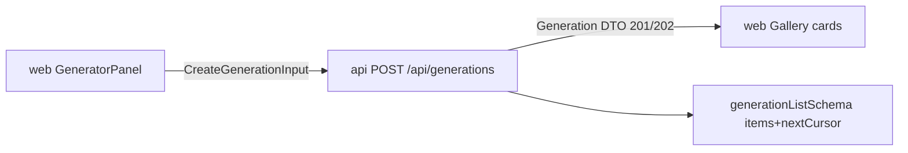

# generation.ts — AI component doc

> AI-facing sidecar for `generation.ts`. Created 2026-07-06. Keep this in sync with the code on every change.

## Purpose
Contracts for the generation lifecycle: the `POST /api/generations` request body and the `Generation` DTO (plus paginated list shape) returned by all generation endpoints.

## What it does (for an AI reader)
- Responsibilities: validate creation input (prompt 2–2000 chars, optional aspect ratio, optional duration 1–15s, optional `inputImage` as data URI ≤14MB, optional structured `promptPreset`, optional TTS `voice`) and the full DTO (status/progress/mediaUrls/`composedPrompt`/`promptPreset`/errorMessage/`errorCode`/timestamps).
- Public API / exports: `generationTypeSchema` (**image|video|audio|model3d**), `generationModeSchema`, `generationStatusSchema`, `createGenerationInputSchema`/`CreateGenerationInput`, `generationParamsSchema`, `generationSchema`/`Generation`, `generationListSchema`/`GenerationList`.
- Inputs → Outputs: unknown JSON → typed input/DTO; API routes return 400 envelope on input parse failure.
- Side effects: none (pure schemas).

## Dependencies
- Imports / depends on: `zod`, `./catalog` (`aspectRatioSchema`), `./presets` (`promptPresetSchema`), `./errors` (`apiErrorCodeSchema` for `errorCode`).
- Used by: `apps/api` `modules/generations/routes.ts` (body validation) and `service.ts` (`toDto` must satisfy `generationSchema`), `apps/web` Generator mutation + Gallery queries/polling. Tested in `src/generation.test.ts`.

## Diagram

## Key decisions / gotchas
- `inputImage` must start with `data:image/` — deliberate SSRF guard: the API never fetches user-supplied URLs. 14MB cap ≈ 10MB file after base64 inflation (matches API `bodyLimit` 15MB).
- Dates are ISO strings (JSON has no Date; SQLite stores ms timestamps — API converts).
- `progress` is nullable AND optional: only processing videos report it.
- `status` enum `processing|succeeded|failed`: images may return `succeeded` immediately (201); video returns `processing` (202) and the web polls every 4s.
- `errorCode` (nullable + optional, `apiErrorCodeSchema`) is the machine-readable failure reason on failed rows — the SPA maps `content_blocked` (NSFW safety filter) to a dedicated localized message instead of showing the raw provider errorMessage.
- CinemaStudio additions (2026-07-09): `type` gains `'audio'`; `aspectRatio` is now optional on both input and params (audio has none — image/video still carry it and the service enforces it); input gains `promptPreset` (structure, composed server-side — never client-concatenated) and `voice` (TTS); DTO gains `composedPrompt` (what the model saw; null → read `prompt`) and `promptPreset` (echoed for Regenerate). All additive: a request with none of the new fields behaves exactly as before.

## Key decisions (2026-07-11) — Studio3D
- `type` gains `'model3d'` (Task 1 of the photo-to-3d-studio plan). It rides the exact same async lifecycle as video/audio — submit charges credits, the API polls the provider, failure refunds — behind a `Mesh3dProvider` seam mirroring `VideoProvider`. No new fields needed on `createGenerationInputSchema`/`generationSchema` for this step: a model3d request reuses `inputImage` (the source photo) and skips `aspectRatio`/`duration` like audio does. Purely additive — existing image/video/audio rows and requests are unaffected. Downstream exhaustive switches over `generationTypeSchema` in `apps/api` and `apps/web` now fail typecheck until later tasks add the `'model3d'` branch — that is intentional and tracked by those tasks, not a regression here.

## Update 2026-07-15 — native generation audio
- `createGenerationInputSchema` += `audio?: boolean` (video only; the service
  refuses it on models without `nativeAudio` and prices it from the with-audio
  table on 'switchable' ones).
- `generationParamsSchema` += `audio?: boolean` — PROVENANCE: stamped true when
  the clip carries a native soundtrack ('switchable'+requested, or 'always').
  The film render trusts this instead of probing files.

## Commits
- 5c5d863 feat(contracts): shared zod schemas for catalog, generations, credits, user, errors
- 3b96d8c fix(api,web,contracts): respect the NSFW flag — content_blocked failure with refund, never store flagged assets, localized safety copy
- b6ab9ec feat: CinemaStudio, entity library and shared/ui listbox refactor
