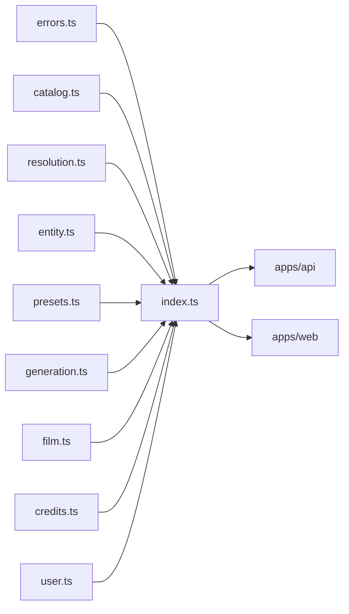

# index.ts — AI component doc

> AI-facing sidecar for `index.ts`. Created 2026-07-06. Keep this in sync with the code on every change.

## Purpose
Public API barrel of `@opencreate/contracts` — the only import path (`package.json` `exports` maps `.` → this file) for both apps.

## What it does (for an AI reader)
- Responsibilities: re-export everything from `errors`, `catalog`, `resolution`, `entity`, `presets`, `generation`, `film`, `credits`, `user`.
- Public API / exports: the union of all modules' exports (schemas + inferred types).
- Inputs → Outputs: none at runtime beyond module re-export.
- Side effects: none.

## Dependencies
- Imports / depends on: `./errors`, `./catalog`, `./resolution`, `./entity`, `./presets`, `./generation`, `./film`, `./credits`, `./user`. Note `presets` is re-exported BEFORE `generation` because `generation.ts` imports `promptPresetSchema` from it.
- Used by: `apps/api` and `apps/web` via `import { ... } from '@opencreate/contracts'`.

## Diagram

## Key decisions / gotchas
- Apps must import from the package root only, never deep paths — keeps the contract surface controlled by this barrel.
- Exported as TS source (`./src/index.ts`); consumers compile it via their own bundler/tsx (no build step in contracts).

## Commits
- 5c5d863 feat(contracts): shared zod schemas for catalog, generations, credits, user, errors

## Update 2026-07-11 — template catalog
- Now also re-exports `./templates` (the `/templates` gallery DTO + the from-template request:
  `TemplateSummary`, `TemplateBeat`, `TemplateTierOffer`, `TemplateTier`, `TEMPLATE_TIERS`,
  `TemplateCategory`, `TemplateList`, `createFilmFromTemplateInputSchema`/`CreateFilmFromTemplateInput`).
- **Order matters here**: `./templates` is exported AFTER `./film`, because a template instantiates
  into a `FilmDetail` — the same "export the dependency first" rule that puts `presets` before
  `generation`.
- What is NOT exported, on purpose: the templates THEMSELVES. Their prompts, and the English fragment
  each knob option expands to, live server-side in `apps/api/src/modules/templates/` and never cross
  the wire (see that module's `types.ts` header). Only a prompt-free `TemplateSummary` travels.
