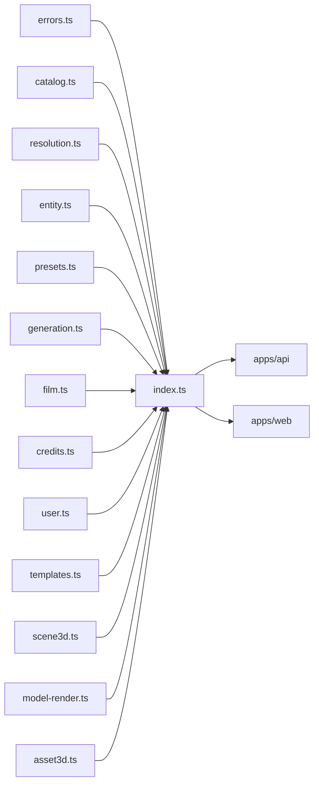

# index.ts — AI component doc

> AI-facing sidecar for `index.ts`. Created 2026-07-06. Keep this in sync with the code on every change.

## Purpose
Public API barrel of `@opencreate/contracts` — the only import path (`package.json` `exports` maps `.` → this file) for both apps.

## What it does (for an AI reader)
- Responsibilities: re-export everything from `errors`, `catalog`, `resolution`, `entity`, `presets`, `generation`, `film`, `templates`, `credits`, `user`, `auth-config`, `scene3d`, `model-render`, `asset3d`, `prompt`, `compare`, `canvas`.
- Public API / exports: the union of all modules' exports (schemas + inferred types).
- Inputs → Outputs: none at runtime beyond module re-export.
- Side effects: none.

## Dependencies
- Imports / depends on: `./errors`, `./catalog`, `./resolution`, `./entity`, `./presets`, `./generation`, `./film`, `./templates`, `./credits`, `./user`, `./scene3d`, `./model-render`, `./asset3d`. Note `presets` is re-exported BEFORE `generation` because `generation.ts` imports `promptPresetSchema` from it.
- Used by: `apps/api` and `apps/web` via `import { ... } from '@opencreate/contracts'`.

## Diagram

## Key decisions / gotchas
- Apps must import from the package root only, never deep paths — keeps the contract surface controlled by this barrel.
- Exported as TS source (`./src/index.ts`); consumers compile it via their own bundler/tsx (no build step in contracts).

## Commits
- 5c5d863 feat(contracts): shared zod schemas for catalog, generations, credits, user, errors
- 789adb5 feat: template catalog — Brainrot Studio (fruit/cat drama, talking food)
- 863a9c0 feat(contracts): portable scene preset (one JSON, N renderers)
- 11a0e97 feat(canvas): wire contracts for the node-graph aggregate

## Update 2026-07-11 — model render + share (Task 3)
- Now also re-exports `./model-render`: `modelRenderStatusSchema`, `createModelRenderInputSchema`/
  `CreateModelRenderInput`, `modelRenderSchema`/`ModelRender`, `modelRenderListSchema`,
  `modelShareSchema`/`ModelShare`.
- Exported last (after `scene3d`) — no dependency-ordering constraint; nothing else in the barrel
  imports from it yet.
- Why this file exists: ADR D3 draws a hard line between a **generation** (charges credits, calls a
  paid provider) and a **render** (spends only our own compute — browser WebCodecs today, a future
  server-side renderer later). `model-render.ts` is the wire shape for that render plus its public,
  revocable share link; it deliberately carries no `costCredits`/charge/refund field anywhere.

## Update 2026-07-11 — template catalog
- Now also re-exports `./templates` (the `/templates` gallery DTO + the from-template request:
  `TemplateSummary`, `TemplateBeat`, `TemplateTierOffer`, `TemplateTier`, `TEMPLATE_TIERS`,
  `TemplateCategory`, `TemplateList`, `createFilmFromTemplateInputSchema`/`CreateFilmFromTemplateInput`).
- **Order matters here**: `./templates` is exported AFTER `./film`, because a template instantiates
  into a `FilmDetail` — the same "export the dependency first" rule that puts `presets` before
  `generation`.
- What is NOT exported, on purpose: the templates THEMSELVES. Their prompts, and the English fragment
  each knob option expands to, live server-side in `apps/api/src/modules/templates/` and never cross
  the wire (see that module's `types.ts` header). Only a prompt-free `TemplateSummary` travels.

## Update 2026-07-11 — Studio3D scene preset (Task 2)
- Now also re-exports `./scene3d`: `scenePresetSchema`/`ScenePreset`, `SCENE_PRESETS`, `getScenePreset`.
- Exported last (after `user`) — nothing else in the barrel depends on it yet; it has no
  dependency ordering constraint like `presets`→`generation` or `film`→`templates`.
- Why this file exists at all: the Studio3D ADR's photo→3D flow needs ONE lighting/camera/tonemap
  definition that both the browser's three.js viewer and a future server-side renderer (headless
  Chromium or Blender) can read, so the preview the user tweaks matches the rendered turntable
  video byte-for-byte in intent. Putting it in the shared barrel — not apps/web-only — is what makes
  that guarantee possible.

## Update 2026-07-18 — Modular 3D Assets contracts (Task 1)
- Now also re-exports `./asset3d` (ADR modular-3d-assets): `MAX_PARTS`, `partStatusSchema`/`PartStatus`,
  `partTransformSchema`/`PartTransform`, `asset3dSchema`/`Asset3d`, `asset3dPartSchema`/`Asset3dPart`,
  `createAsset3dInputSchema`/`CreateAsset3dInput`, `updateAsset3dInputSchema`/`UpdateAsset3dInput`,
  `createAsset3dPartInputSchema`/`CreateAsset3dPartInput`,
  `updateAsset3dPartInputSchema`/`UpdateAsset3dPartInput`, `meshPartInputSchema`/`MeshPartInput`,
  `asset3dDetailSchema`/`Asset3dDetail`, `asset3dListSchema`/`Asset3dList`, `analyzePartSchema`/`AnalyzePart`,
  `analyzeResponseSchema`/`AnalyzeResponse`.
- Exported AFTER `./generation` (in reader order, after `./model-render`) because a part CITES a
  generation by id — the same "export the dependency-in-concept first" ordering note as
  `presets`→`generation` and `film`→`templates`, though `asset3d.ts` imports only `zod` (no code edge).
- Why this file exists: an `asset3d` is an aggregate that cites generations instead of owning media
  (the Film/Shot pattern). Part status is DERIVED from the cited generations at read time and lives on
  the read DTO only — never a stored column, never on any input — so the contract encodes the
  no-second-source-of-truth rule the films/shots work taught. No new `apiErrorCode`: analyze reuses the
  existing `provider_error` (502) when `ANTHROPIC_API_KEY` is unset, like storyboard.

## Update 2026-07-21 — prompt enhancer contracts
- Now also re-exports `./prompt`: `promptEnhanceModeSchema`/`PromptEnhanceMode`,
  `promptEnhanceInputSchema`/`PromptEnhanceInput`, `promptEnhanceResultSchema`/`PromptEnhanceResult`.
- Exported LAST (after `./asset3d`) — it imports only `zod` and nothing else in the barrel depends on
  it, so ordering is immaterial (unlike `presets`→`generation` or `film`→`templates`).
- Why this file exists: `POST /api/prompt/enhance` is a generic, FREE, stateless text transform (rough
  idea → one cinematic Wan prompt) serving both the Cinema composer and the "soften & retry" a
  `content_blocked` generation offers. Prompt text DOES travel on the wire here (unlike templates/presets,
  which keep prompts server-side) because handing the improved text back IS the feature. No new
  `apiErrorCode`: it reuses `provider_error` (502) when `DEEPINFRA_TOKEN` is unset, exactly like storyboard.

## Update 2026-07-30 — Canvas Mode contracts (Task 1)
- Now also re-exports `./canvas` (ADR canvas-mode): `canvasNodeKindSchema`/`CanvasNodeKind`,
  `canvasViewportSchema`/`CanvasViewport`, `canvasNodeConfigSchema`/`CanvasNodeConfig`,
  `canvasNodeSchema`/`CanvasNode`, `canvasEdgeSchema`/`CanvasEdge`, `canvasSchema`/`Canvas`,
  `canvasDetailSchema`/`CanvasDetail`, `canvasListSchema`/`CanvasList`,
  `createCanvasInputSchema`/`CreateCanvasInput`, `updateCanvasInputSchema`/`UpdateCanvasInput`,
  `canvasUploadInputSchema`/`CanvasUploadInput`, `canvasUploadResultSchema`/`CanvasUploadResult`.
- Exported LAST (after `./compare`) — it imports only `zod` and nothing else in the barrel depends
  on it, so ordering is immaterial (unlike `presets`→`generation` or `film`→`templates`).
- Why this file exists: a `canvas` is the node-graph aggregate that CITES generations (the Film/Shot
  and Asset3d pattern again) — nodes hold editor config plus an append-only `generationIds` history,
  while money, media, and provider state stay in the generation system. The distinguishing constraint
  is that PATCH carries the FULL document (debounced autosave, last-write-wins, single owner), so
  every collection and string here is explicitly bounded: the bounds are what keeps one hostile
  autosave from persisting megabytes.

## Update 2026-07-30 — openCreator agent contracts (Task 1)
- Now also re-exports `./creator` (ADR opencreator-agent): `creatorSessionStatusSchema`/`CreatorSessionStatus`,
  `creatorMessageContentSchema`/`CreatorMessageContent`, `creatorMessageSchema`/`CreatorMessage`,
  `creatorSessionSchema`/`CreatorSession`, `creatorSessionDetailSchema`/`CreatorSessionDetail`,
  `creatorSessionListSchema`/`CreatorSessionList`, `createCreatorSessionInputSchema`/`CreateCreatorSessionInput`,
  `postCreatorMessageInputSchema`/`PostCreatorMessageInput`.
- Exported LAST (after `./canvas`) — it imports only `zod`, and it cites canvases/entities/generations
  by plain id string rather than by their types, so nothing in the barrel depends on it and ordering
  is immaterial.
- Why this file exists: openCreator is a CHAT whose transcript IS the agent's audit trail — every
  executed tool becomes a `step` message and the budget gate becomes a `plan` message, so one
  `GET /api/creator/sessions/:id` re-renders the whole story and a reload loses nothing. Note what is
  deliberately absent: no `tool` role (raw tool JSON never reaches the chat) and no money field beyond
  the informational `costCredits` on a step — the gate is enforced in `modules/creator/tools.ts`
  against the session's `confirmed` flag, never by this schema.
