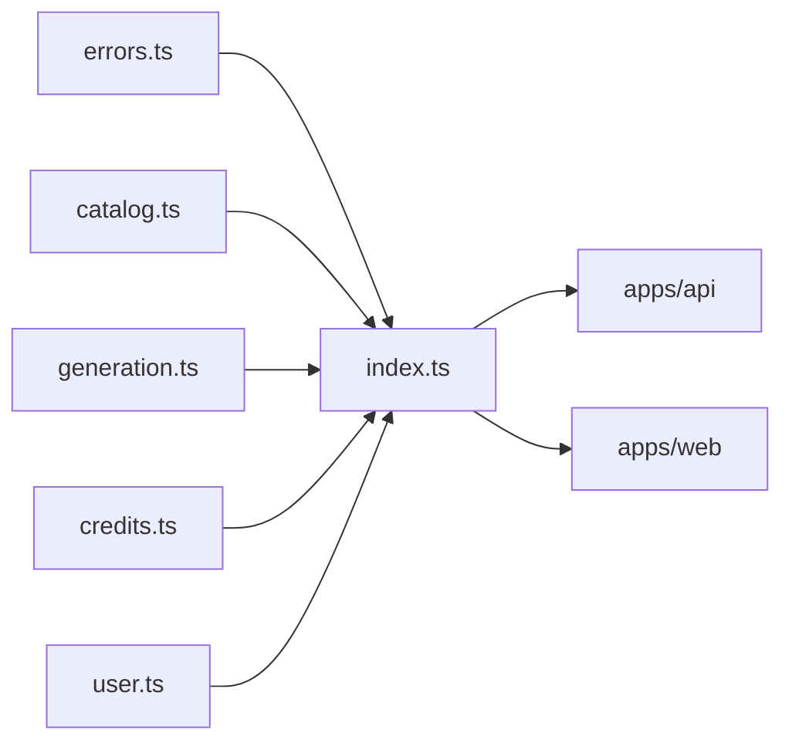

# index.ts — AI component doc

> AI-facing sidecar for `index.ts`. Created 2026-07-06. Keep this in sync with the code on every change.

## Purpose
Public API barrel of `@opencreate/contracts` — the only import path (`package.json` `exports` maps `.` → this file) for both apps.

## What it does (for an AI reader)
- Responsibilities: re-export everything from `errors`, `catalog`, `generation`, `credits`, `user`.
- Public API / exports: the union of all five modules' exports (schemas + inferred types).
- Inputs → Outputs: none at runtime beyond module re-export.
- Side effects: none.

## Dependencies
- Imports / depends on: `./errors`, `./catalog`, `./generation`, `./credits`, `./user`.
- Used by: `apps/api` and `apps/web` via `import { ... } from '@opencreate/contracts'`.

## Diagram

## Key decisions / gotchas
- Apps must import from the package root only, never deep paths — keeps the contract surface controlled by this barrel.
- Exported as TS source (`./src/index.ts`); consumers compile it via their own bundler/tsx (no build step in contracts).

## Commits
- _no commit yet_
