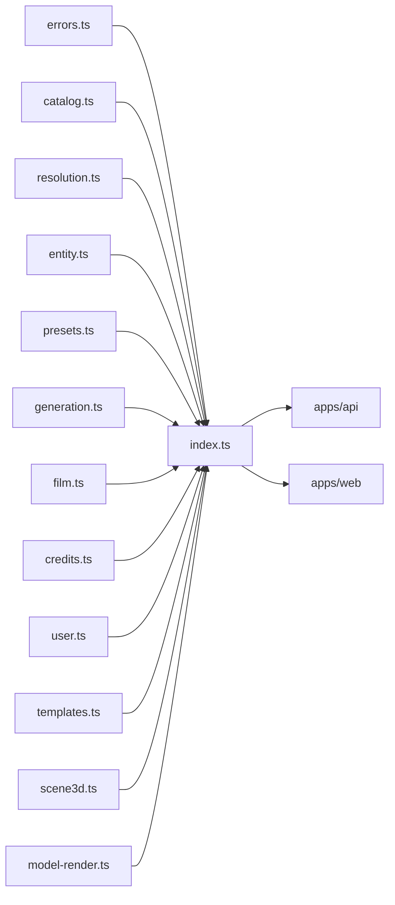

# index.ts — AI component doc

> AI-facing sidecar for `index.ts`. Created 2026-07-06. Keep this in sync with the code on every change.

## Purpose
Public API barrel of `@opencreate/contracts` — the only import path (`package.json` `exports` maps `.` → this file) for both apps.

## What it does (for an AI reader)
- Responsibilities: re-export everything from `errors`, `catalog`, `resolution`, `entity`, `presets`, `generation`, `film`, `templates`, `credits`, `user`, `scene3d`, `model-render`.
- Public API / exports: the union of all modules' exports (schemas + inferred types).
- Inputs → Outputs: none at runtime beyond module re-export.
- Side effects: none.

## Dependencies
- Imports / depends on: `./errors`, `./catalog`, `./resolution`, `./entity`, `./presets`, `./generation`, `./film`, `./templates`, `./credits`, `./user`, `./scene3d`, `./model-render`. Note `presets` is re-exported BEFORE `generation` because `generation.ts` imports `promptPresetSchema` from it.
- Used by: `apps/api` and `apps/web` via `import { ... } from '@opencreate/contracts'`.

## Diagram

## Key decisions / gotchas
- Apps must import from the package root only, never deep paths — keeps the contract surface controlled by this barrel.
- Exported as TS source (`./src/index.ts`); consumers compile it via their own bundler/tsx (no build step in contracts).

## Commits
- 5c5d863 feat(contracts): shared zod schemas for catalog, generations, credits, user, errors
- 789adb5 feat: template catalog — Brainrot Studio (fruit/cat drama, talking food)
- 863a9c0 feat(contracts): portable scene preset (one JSON, N renderers)

## Update 2026-07-11 — model render + share (Task 3)
- Now also re-exports `./model-render`: `modelRenderStatusSchema`, `createModelRenderInputSchema`/
  `CreateModelRenderInput`, `modelRenderSchema`/`ModelRender`, `modelRenderListSchema`,
  `modelShareSchema`/`ModelShare`.
- Exported last (after `scene3d`) — no dependency-ordering constraint; nothing else in the barrel
  imports from it yet.
- Why this file exists: ADR D3 draws a hard line between a **generation** (charges credits, calls a
  paid provider) and a **render** (spends only our own compute — browser WebCodecs today, a future
  server-side renderer later). `model-render.ts` is the wire shape for that render plus its public,
  revocable share link; it deliberately carries no `costCredits`/charge/refund field anywhere.

## Update 2026-07-11 — template catalog
- Now also re-exports `./templates` (the `/templates` gallery DTO + the from-template request:
  `TemplateSummary`, `TemplateBeat`, `TemplateTierOffer`, `TemplateTier`, `TEMPLATE_TIERS`,
  `TemplateCategory`, `TemplateList`, `createFilmFromTemplateInputSchema`/`CreateFilmFromTemplateInput`).
- **Order matters here**: `./templates` is exported AFTER `./film`, because a template instantiates
  into a `FilmDetail` — the same "export the dependency first" rule that puts `presets` before
  `generation`.
- What is NOT exported, on purpose: the templates THEMSELVES. Their prompts, and the English fragment
  each knob option expands to, live server-side in `apps/api/src/modules/templates/` and never cross
  the wire (see that module's `types.ts` header). Only a prompt-free `TemplateSummary` travels.

## Update 2026-07-11 — Studio3D scene preset (Task 2)
- Now also re-exports `./scene3d`: `scenePresetSchema`/`ScenePreset`, `SCENE_PRESETS`, `getScenePreset`.
- Exported last (after `user`) — nothing else in the barrel depends on it yet; it has no
  dependency ordering constraint like `presets`→`generation` or `film`→`templates`.
- Why this file exists at all: the Studio3D ADR's photo→3D flow needs ONE lighting/camera/tonemap
  definition that both the browser's three.js viewer and a future server-side renderer (headless
  Chromium or Blender) can read, so the preview the user tweaks matches the rendered turntable
  video byte-for-byte in intent. Putting it in the shared barrel — not apps/web-only — is what makes
  that guarantee possible.
