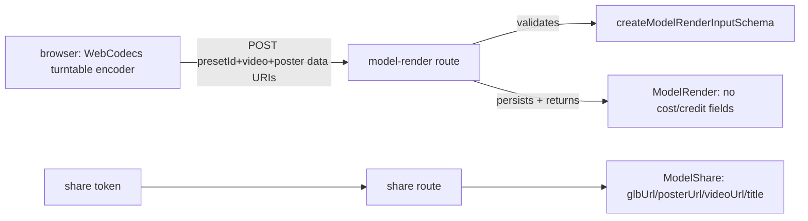

# model-render.ts — AI component doc

> AI-facing sidecar for `model-render.ts`. Created 2026-07-11. Keep this in sync with the code on every change.

## Purpose
Wire contract for a Studio3D "render" — turning a 3D model (`model3d` generation) into a turntable video — plus the public, revocable share of a model. Encodes the ADR D3 rule that **a render is not a generation**: it spends our compute, not a paid provider call, so unlike `generation` it carries no credit ledger at all (no `costCredits`, no charge, no refund). Mirrors the existing `film_render` precedent.

## What it does (for an AI reader)
- Responsibilities: validate the POST body a client sends after it renders a turntable video client-side (WebCodecs) and uploads the result; describe the `ModelRender` DTO the API returns (full status machine, even though v1 has only one engine); describe the `ModelShare` DTO for a public embed link.
- Public API / exports: `modelRenderStatusSchema` (`'processing' | 'succeeded' | 'failed'`), `createModelRenderInputSchema` + `CreateModelRenderInput`, `modelRenderSchema` + `ModelRender`, `modelRenderListSchema`, `modelShareSchema` + `ModelShare`.
- Inputs → Outputs: client POSTs `{ presetId, video, poster }` (data URIs) → API persists a `model_render` row and returns a `ModelRender`; a share token resolves to a `ModelShare` (GLB + poster + optional video + title) for the public embed page.
- Side effects: none in this file (pure zod schemas). The route that consumes `createModelRenderInputSchema` is the one with I/O (writing the video/poster to storage, inserting the DB row).

## Dependencies
- Imports / depends on: `zod` only.
- Used by: (not yet wired) the future `apps/api` model-render route/service and the `apps/web` turntable-encoder upload flow + public embed page. `generationId` on `modelRenderSchema` is expected to reference a `model3d` generation (see `generation.ts`), but this file has no import relationship to `generation.ts` — the link is a plain string id, kept loosely coupled on purpose.

## Diagram

## Key decisions / gotchas
- No credit/cost field anywhere in this file, on purpose — the single biggest thing an AI reader must not "fix" by adding one back. A render spends our own compute (browser or, later, server-side Chromium/Blender), never a paid provider invoice, so it never charges and never refunds. Contrast with `generation.ts`'s `costCredits` (a paid provider call).
- `video`/`poster` are validated with an ANCHORED regex (`/^data:video\/mp4;base64,/`, `/^data:image\/(png|jpe?g|webp);base64,/`), not `.startsWith()`. A prefix check has no boundary character — `'data:video/mp4evil,...'.startsWith('data:video/mp4')` and `'data:image/svg+xml,...'.startsWith('data:image/')` are both `true`. Never use `.startsWith()` for a mime/scheme gate in this file again; always anchor with a regex that includes the delimiter that must follow.
- `poster`'s mime list is intentionally CLOSED to `png|jpeg|jpg|webp` — no `image/svg+xml`, and no unbounded `image/*`. This is not an oversight: an SVG can embed `<script>`, so an "image" poster would be a stored-XSS surface the instant it is served back from our origin or opened directly. `apps/api/src/storage/dataUri.ts` makes the identical call (its `MIME_TO_EXT` table has no svg entry either) for the identical reason — this schema is the first gate this payload passes, so it has to enforce the same rule, not just assume a later layer will.
- Same SSRF-avoidance rule as `generation.ts`'s `inputImage` underlies both fields: data URIs only, never URLs, so the API is never made to fetch an arbitrary user-supplied host.
- `MAX_VIDEO_CHARS = 40_000_000` (40MB of base64 text): sized for a ~6s 1080p H.264 clip (~3-8MB raw, ×~1.37 base64 inflation) with headroom for 4K, while still bounding upload size. Whatever Fastify route accepts this body must raise its own `bodyLimit` to match — the app-wide default (15MB) is too small and will reject a valid render before this schema even runs.
- `status` carries a full processing/succeeded/failed machine even though v1 always resolves synchronously in one POST (the browser only uploads once it already has the finished file). This is deliberate: a future server-side renderer (`engine: 'chromium' | 'blender'`) will need async polling, and the row shape is designed not to need a breaking migration when that lands.
- `engine` is `z.enum(['browser', 'chromium', 'blender'])`, not a bare string. Reviewed and reversed from an earlier bare-`z.string()` draft: the rationale for a string ("adding a backend stays additive") doesn't hold inside a single in-monorepo package, where widening an enum is just as atomic a change as widening a string — and `status` right above it is already an enum for the same "future states" reason, so the inconsistency was buying nothing. `'browser'` is the only value v1 ever writes.
- `modelShareSchema.token` IS the row's id (an unguessable UUID) rather than a separate secret field or a boolean flag on `generation` — this means revoking a share is a plain `DELETE` on the share row, and the share feature never has to touch the `generation` table.

## Commits
- 4ac1e8a feat(contracts): model render + share wire types
- f33be9e fix(contracts): anchor render data-URI validation, reject SVG posters
