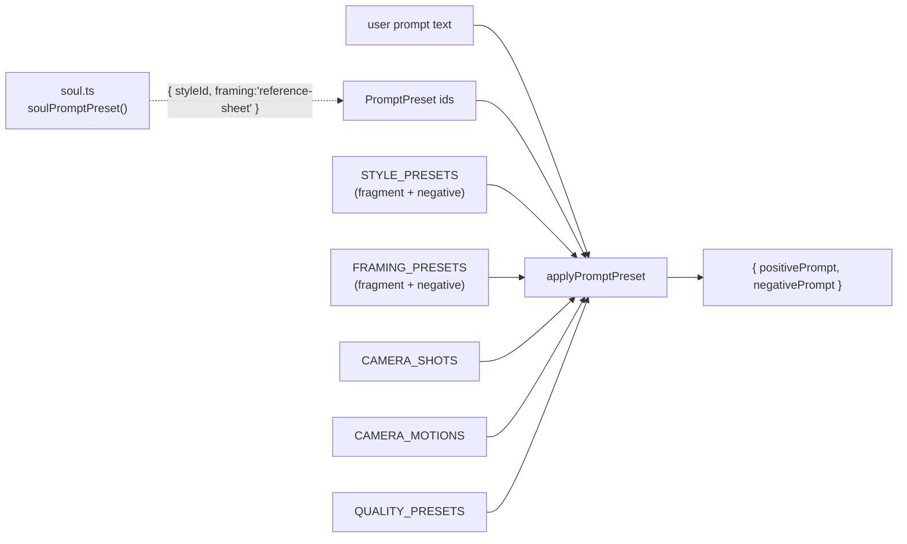

# presets.ts — AI component doc

> AI-facing sidecar for `presets.ts`. Created 2026-07-09. Keep this in sync with the code on every change.

## Purpose
CinemaStudio prompt-preset tables (style / camera shot / camera motion / quality) plus the pure
`applyPromptPreset` function that composes them into a positive+negative prompt. Lives in contracts
so the web renders pickers and the API composes prompts from the SAME source — a preset is a named
choice (structure), never free text (prose). ADR: `docs/wiki/decisions/cinema-studio.md` §3.

## What it does (for an AI reader)
- Responsibilities: hold the canonical preset tables; turn a structured `PromptPreset` + the user's
  text into the model-facing `{ positivePrompt, negativePrompt }`.
- Public API / exports:
  - Schemas: `styleIdSchema`, `framingSchema`, `cameraShotSchema`, `cameraMotionSchema`, `qualitySchema`, `promptPresetSchema`.
  - Types: `StyleId`, `Framing`, `CameraShot`, `CameraMotion`, `Quality`, `StylePreset`, `PresetOption`,
    `NegatingPresetOption`, `PromptPreset`, `ComposedPrompt`.
  - Tables: `STYLE_PRESETS` (7: disney/anime/2d-cartoon/3d-cartoon/**hand-drawn**/**comic**/cinematic;
    each has `fragment`, `negative`, `recommendedModelId`), `FRAMING_PRESETS` (none/**reference-sheet**),
    `CAMERA_SHOTS`, `CAMERA_MOTIONS`, `QUALITY_PRESETS`.
  - Function: `applyPromptPreset(userPrompt, preset?) → { positivePrompt, negativePrompt }`.
- Inputs → Outputs: `(userPrompt: string, preset?: PromptPreset)` → composed prompts. Order is fixed:
  style, framing, shot, motion, quality, then user text LAST. Empty fragments contribute nothing (no
  dangling commas). Negatives are **collected and joined** across every axis that carries one
  (style, framing).
- Side effects: none. Pure data + pure function.

## Dependencies
- Imports / depends on: `zod`.
- Used by (planned): `packages/contracts/src/index.ts` (re-export); the API generation service
  (composes server-side, AFTER entity substitution in `modules/entities/mentions.ts`); the web
  Cinema module's shot composer (renders pickers from the tables). Name `applyPromptPreset` is
  deliberately distinct from `mentions.composePrompt` — they compose in sequence, not compete.

## Diagram

## Key decisions / gotchas
- **Negatives are JOINED, not assigned** (changed for Soul Studio). Style used to be the only axis
  with a negative, so a single `=` sufficed. `framing` is the second: `negativePrompt = framing.negative`
  would have silently DROPPED the style's — a Disney reference sheet would stop pushing away
  "photorealistic" the moment it started pushing away "busy background". With exactly one negative
  present the joined output is byte-identical to the old behaviour, so every pre-existing request is
  unaffected.
- **`framing: 'reference-sheet'`** is what makes Soul Studio's "clean and understandable" portraits a
  *named, tested thing* instead of a magic string in the API. Half its work is in the NEGATIVE (busy
  background, multiple characters, text, watermark, cropped) — a positive-only `PresetOption` cannot
  express that, hence `NegatingPresetOption`. Reusable by CinemaStudio (a clean product shot wants
  exactly the same thing).
- **`comic` is not a second `2d-cartoon`.** `2d-cartoon` is flat, soft and playful; `comic` is INKED —
  hard black linework, halftone dots, cel colour. Its negative pushes away both a soft painterly
  render *and* **anime**, because that is the illustrated tradition a diffusion model has far more
  training data for and will otherwise drift into. It is deliberately on the SHARED `StyleId` enum, so
  it also appears in CinemaStudio's picker — judged desirable (a character built in `comic` and a film
  shot in `comic` must agree), not a leak.
- Additive by design: no `promptPreset` → composed prompt is exactly the user's text. Existing
  ChatComposer is untouched.
- `'none'` is a real first-class option on the modifier axes so the UI can offer "no preference"
  without special-casing `undefined`.
- Unknown id → treated as absent, never emitted literally (correctness core, mirrors mentions.ts).
- Tables are literal objects with `satisfies` (not `Record<K,V>`) so `noUncheckedIndexedAccess`
  keeps `STYLE_PRESETS.disney` etc. fully defined without guards.
- **`hand-drawn` is not a second `2d-cartoon`.** `2d-cartoon` is flat, bold, playful (TV cartoon);
  `hand-drawn` is an animated *feature* — painted on twos, oil-brush, line boil, deliberately
  unsmooth. Its `negative` actively pushes away `smooth interpolated motion, motion blur` because
  video models default to frame-interpolated movement and will otherwise render a 2D-looking picture
  that *moves* like a 3D render. Extracted from the «Буран» template's reference prompt
  (`apps/api/src/modules/templates/catalog/buran.ts`), but it is drawing technique ONLY — the
  reference's lightless night and handheld operator stayed out, so the style is reusable on a sunlit
  hand-drawn film too. Adding a style id costs one i18n key per locale
  (`cinema.preset.style.<id>` in `en.json` / `ru.json`); the pickers build themselves from the enum.

## Commits
- _no commit yet_
