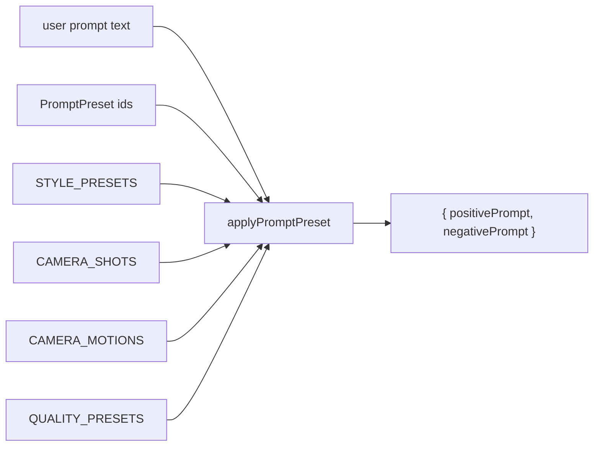

# presets.ts — AI component doc

> AI-facing sidecar for `presets.ts`. Created 2026-07-09. Keep this in sync with the code on every change.

## Purpose
CinemaStudio prompt-preset tables (style / camera shot / camera motion / quality) plus the pure
`applyPromptPreset` function that composes them into a positive+negative prompt. Lives in contracts
so the web renders pickers and the API composes prompts from the SAME source — a preset is a named
choice (structure), never free text (prose). ADR: `docs/wiki/decisions/cinema-studio.md` §3.

## What it does (for an AI reader)
- Responsibilities: hold the canonical preset tables; turn a structured `PromptPreset` + the user's
  text into the model-facing `{ positivePrompt, negativePrompt }`.
- Public API / exports:
  - Schemas: `styleIdSchema`, `cameraShotSchema`, `cameraMotionSchema`, `qualitySchema`, `promptPresetSchema`.
  - Types: `StyleId`, `CameraShot`, `CameraMotion`, `Quality`, `StylePreset`, `PresetOption`, `PromptPreset`, `ComposedPrompt`.
  - Tables: `STYLE_PRESETS` (5: disney/anime/2d-cartoon/3d-cartoon/cinematic; each has `fragment`,
    `negative`, `recommendedModelId`), `CAMERA_SHOTS`, `CAMERA_MOTIONS`, `QUALITY_PRESETS`.
  - Function: `applyPromptPreset(userPrompt, preset?) → { positivePrompt, negativePrompt }`.
- Inputs → Outputs: `(userPrompt: string, preset?: PromptPreset)` → composed prompts. Order is fixed:
  style, shot, motion, quality, then user text LAST. Empty fragments contribute nothing (no dangling
  commas). Negative comes from the style only.
- Side effects: none. Pure data + pure function.

## Dependencies
- Imports / depends on: `zod`.
- Used by (planned): `packages/contracts/src/index.ts` (re-export); the API generation service
  (composes server-side, AFTER entity substitution in `modules/entities/mentions.ts`); the web
  Cinema module's shot composer (renders pickers from the tables). Name `applyPromptPreset` is
  deliberately distinct from `mentions.composePrompt` — they compose in sequence, not compete.

## Diagram

## Key decisions / gotchas
- Additive by design: no `promptPreset` → composed prompt is exactly the user's text. Existing
  ChatComposer is untouched.
- `'none'` is a real first-class option on the modifier axes so the UI can offer "no preference"
  without special-casing `undefined`.
- Unknown id → treated as absent, never emitted literally (correctness core, mirrors mentions.ts).
- Tables are literal objects with `satisfies` (not `Record<K,V>`) so `noUncheckedIndexedAccess`
  keeps `STYLE_PRESETS.disney` etc. fully defined without guards.

## Commits
- _no commit yet_
