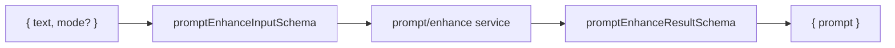

# prompt.ts — AI component doc

> AI-facing sidecar for `prompt.ts`. Created 2026-07-21. Keep this in sync with the code on every change.

## Purpose
Wire contracts for `POST /api/prompt/enhance` — a generic, stateless, FREE text transform that
rewrites a user's rough shot idea into ONE detailed cinematic prompt for the Wan text-to-video model.
Serves the Cinema prompt-enhancer UI and the "soften & retry" action a `content_blocked` failure offers.

## What it does (for an AI reader)
- Responsibilities: define the request/response schemas shared by apps/api and apps/web; there is no
  server-side prompt to hide (unlike templates.ts) — the improved text IS the payload.
- Public API / exports / props / endpoints:
  - `promptEnhanceModeSchema` / `PromptEnhanceMode` — `'enhance' | 'soften'`.
  - `promptEnhanceInputSchema` / `PromptEnhanceInput` — `{ text: string(1..2000), mode: default 'enhance' }`.
  - `promptEnhanceResultSchema` / `PromptEnhanceResult` — `{ prompt: string(min 1) }`; ALSO the schema the
    service validates the model completion against.
- Inputs → Outputs: rough idea `{ text, mode? }` → cinematic prompt `{ prompt }`.
- Side effects: none (pure schema definitions).

## Dependencies
- Imports / depends on: `zod`.
- Used by: `apps/api/src/modules/prompt/enhance.ts` (input type + result parse), `apps/api/src/modules/prompt/routes.ts`
  (boundary parse), the Cinema composer (planned), re-exported from `index.ts`.

## Diagram

## Key decisions / gotchas
- `mode` is an enum (not a boolean) so a third rewrite mode is an additive change; it `.default('enhance')`
  so the service never branches on undefined (z.infer OUTPUT type has mode required).
- `text` is bounded 1..2000 at the boundary — empty is nothing to rewrite; 2000 caps the token bill of a
  free endpoint.
- The result `prompt` is `.min(1)`: an empty rewrite is a failure, rejected at parse time so it degrades to a
  clean provider_error instead of a blank prompt reaching the composer.
- Prompt text DOES travel on the wire here, unlike template/preset contracts — the whole endpoint exists to
  hand improved text back.

## Commits
- _no commit yet_
