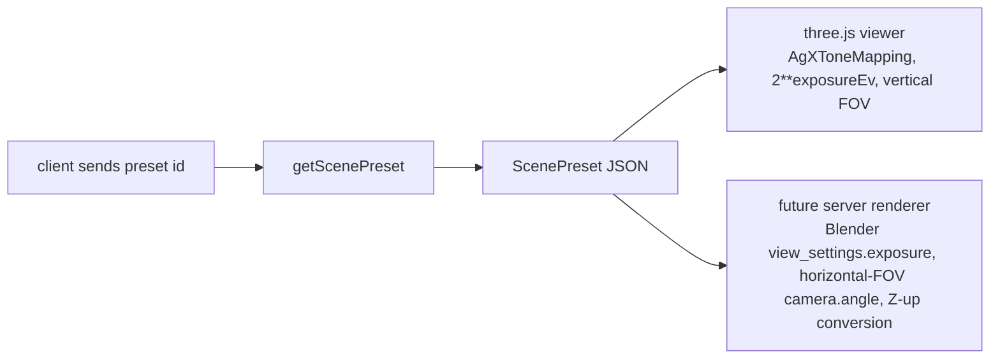

# scene3d.ts — AI component doc

> AI-facing sidecar for `scene3d.ts`. Created 2026-07-11. Keep this in sync with the code on every change.

## Purpose
The portable scene preset contract for Studio3D (ADR photo-to-3d-studio, decision D4). One JSON shape read by both the three.js viewer (browser preview) and any future server-side renderer (headless Chromium or Blender turntable export), so the renderer stays a swappable implementation detail and the preview the user tweaks matches the video they download.

## What it does (for an AI reader)
- Responsibilities: validate a named lighting/camera/tonemap/render rig; ship a fixed, server-owned catalog of 4 presets (`studio`, `product`, `dramatic`, `neon`); resolve a preset by id.
- Public API / exports: `scenePresetSchema` (zod), `ScenePreset` (inferred type), `SCENE_PRESETS` (the 4-entry array), `getScenePreset(id): ScenePreset | undefined`.
- Inputs → Outputs: a preset `id` string → the matching `ScenePreset` object, or `undefined` if unknown. `scenePresetSchema.parse`/`safeParse` validate arbitrary JSON (e.g. a future server renderer's own copy, or a request body) against the shape.
- Side effects: none (pure schema + static data).

## Dependencies
- Imports / depends on: `zod`.
- Used by: (not yet wired) the three.js viewer's preset picker, and later the server-side turntable renderer — both will import `SCENE_PRESETS`/`getScenePreset` so there is exactly one lighting/camera source of truth. The client is expected to send a preset `id` token, never a raw lighting rig.

## Diagram

## Key decisions / gotchas
- Four unit conventions are load-bearing and intentionally over-commented in the code header — breaking any one makes the browser preview and the rendered video diverge silently:
  1. `tonemap.exposureEv` is stored in **EV/stops** (Blender's native unit). three.js's `toneMappingExposure` is a linear multiplier, so the three-side consumer must compute `2 ** exposureEv` — never store the multiplier directly.
  2. `camera.fovVertical` is **vertical** degrees (three's native `PerspectiveCamera.fov`). Blender's `camera.angle` is horizontal by default (`sensor_fit = AUTO`) and must be converted on that side.
  3. `upAxis` is declared (`'Y'` only, for now) because glTF/three are Y-up but Blender is Z-up; the glTF importer fixes the mesh, but the orbit camera path defined here does not auto-convert.
  4. `tonemap.curve` is pinned to the literal `'agx'` — the schema has no other allowed value on purpose. three's `AgXToneMapping` is a faithful port of Blender's AgX view transform (its 4.0+ default); three's `ACES` is a hand-fitted approximation that does NOT match Blender's ACES. A curve without cross-renderer parity is treated as a bug, not an option.
- Presets are **server-owned and named** (`SCENE_PRESETS` is a closed catalog): the wire contract is a token id, never an arbitrary lighting rig, so renders stay reproducible and the preset surface can't grow into an unbounded API.
- `camera.marginPct` + `camera.orbit.radiusFactor` encode deterministic framing (derive camera distance from the model's bounding-sphere radius) rather than drei's `<Bounds>` auto-framing — the exact same arithmetic must run in whatever renders the final video, so it can't live only inside a React Three Fiber helper.
- HDRI ids (`environment.hdriId`) point at self-hosted files (`public/hdri/<id>.hdr|.exr`, not yet added), deliberately never drei's built-in `preset="studio"` shortcut — those fetch from a GitHub-hosted CDN that drei's own docs say is not for production use.
- `dramatic` and `neon` presets are built by spreading a shared `base` object and then overriding `tonemap` afterward — object spread + key order means the later `tonemap` key wins; covered by the "applies the dramatic preset exposure override after spreading base" test so a future refactor that reorders the spread breaks loudly instead of silently reverting to `exposureEv: 0`.

## Commits
- _no commit yet_
