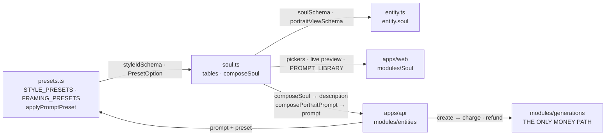

# soul.ts — AI Soul Studio: the structured character spec

> AI-facing sidecar for `soul.ts`. **ADR:** `docs/wiki/decisions/ai-soul-studio.md`

## Purpose

A **soul** is a character specification the user *builds from a constructor* — archetype, style,
age, build, hair, eyes, skin, outfit, vibe, up to six traits ("missing eye", "iron arm", "horns"),
plus a free-text tail. This file holds the option **tables** and the pure **composer** that turns a
`Soul` into the text a diffusion model sees.

## What it does (for an AI reader)

The one rule: **a soul is structure, never prose.** The web renders every picker from these tables;
the API composes the entity description and every portrait prompt from the *same* tables. If the
client concatenated fragments and shipped a string, the stored description would be fragment soup —
the constructor could not round-trip it, and changing one phrase would need a new SPA build.

- **Responsibilities:** own the option tables; compose a `Soul` into subject text, portrait prompts,
  and the preset that carries the style + framing negatives; carry the model rule as data.
- **Side effects:** none. Pure data + pure functions.

### Public API

| Export | Shape | Role |
|---|---|---|
| `soulSchema` / `Soul` | zod object | The wire + storage shape. `archetype` and `styleId` required; every other axis optional; `traits` capped at `MAX_TRAITS`. |
| `ARCHETYPES`, `AGES`, `BUILDS`, `HAIR_COLORS`, `HAIR_STYLES`, `EYE_COLORS`, `SKINS`, `OUTFITS`, `VIBES` | `Record<Id, PresetOption>` | Single-select axes. `PresetOption` is reused from `presets.ts`. |
| `TRAITS` (flat) + `TRAIT_GROUPS` (grouped) | tables | The multi-select axis. The flat table is the single source of each fragment; the groups are the picker's layout, as data. |
| `MAX_TRAITS` = 6 | const | Enforced in the schema **and** re-applied in `composeSoul`. |
| `composeSoul(soul)` | `Soul → string` | The **subject** text. Fixed fragment order. Becomes `entity.description`. |
| `composePortraitPrompt(soul, view)` | `(Soul, PortraitView) → string` | `composeSoul` + the view fragment, last. |
| `soulPromptPreset(soul)` | `Soul → PromptPreset` | `{ styleId, framing: 'reference-sheet' }` — handed to `applyPromptPreset`. |
| `PORTRAIT_VIEWS`, `PORTRAIT_SHEET_VIEWS` | tables | The four views; each carries its own `aspect` (`full-body` is `9:16`, head shots `1:1`). |
| `SOUL_HERO_MODEL_ID` / `SOUL_SHEET_MODEL_ID` | `'flux-dev'` / `'flux-kontext-pro'` | The model rule as data (below). |
| `PROMPT_LIBRARY` | `{ id, label, soul }[]` | The ready-made characters — **Soul literals**, so the UI offers both "Copy prompt" and "Open in constructor". |

### Inputs → outputs

```
Soul ──composeSoul──────────▶ "a woman, jet-black long flowing hair, one eye missing…"   → entity.description
Soul ──composePortraitPrompt▶ "…, front view, facing the camera directly, head and shoulders"
Soul ──soulPromptPreset─────▶ { styleId, framing:'reference-sheet' } ──applyPromptPreset──▶ { positivePrompt, negativePrompt }
```

## Dependencies

- **Imports:** `zod`; `PresetOption` + `styleIdSchema` from `./presets`.
- **Used by:** `./entity` (`entity.soul`, `entityImage.view`, the portraits endpoint schemas) ·
  `apps/api/src/modules/entities/*` (composes the description + portrait prompts, enforces the model
  rule) · `apps/web/src/modules/Soul/*` (renders every picker, the live preview, the prompt library).

## Diagram



## Key decisions / gotchas
- **`soul.styleId` is `builtinStyleIdSchema`, not the open wire id** (ADR style-studio D1, 2026-07-31).
  A soul is a constructor over fixed tables: every other axis is an enum, the UI renders this one as a
  pill row straight out of `STYLE_PRESETS`, and `soulPresentation` indexes that table by this value to
  name the style back to the user. A user style resolves to fragments and nothing else — no label, no
  pill, no reverse lookup — so accepting one here would be a value half the surrounding code cannot
  render. User styles reach a portrait the same way they reach everything else: through the shot's own
  `promptPreset` at generation time. The "ONE style table" intent of the original comment is preserved
  exactly, it just names the builtin schema now.

- **Style is NOT composed into the soul text**, even though `soul.styleId` exists. Style is a
  *preset axis* and it owns a **negative** prompt; composing the fragment here would smuggle in the
  positive half and silently drop the negative. And the description derived from this text gets
  tagged into *other* scenes later, where a different style applies. `soulPromptPreset()` hands
  style + framing to `applyPromptPreset`, which owns both halves.
- **The model rule (ADR §3).** `flux-kontext-pro` is the only catalogue entry that accepts
  `referenceImages`, so a consistent multi-view sheet is only possible by having the character
  reference *itself*: the hero shot renders with no reference (`flux-dev`, 2 cr) and every later
  view references the hero (`flux-kontext-pro`, 8 cr). Without this, four views are four strangers.
- **Fixed fragment order.** `entity.description` is derived from `composeSoul`; a string that
  reshuffles on every save is a string nobody can diff. Pinned by test.
- **Hair is one concept.** Colour is an adjective, style a noun phrase → "platinum blonde long
  flowing hair", not "blonde hair, long hair" (which a text encoder weights twice and blurs).
  "Bald" is deliberately a *trait*, not a hair style — it has no colour, and treating it as one
  would force the composer to special-case "jet-black bald".
- **Six traits, hard.** Enforced by the schema *and* re-sliced in the composer, so a hand-built
  `Soul` literal (a `PROMPT_LIBRARY` entry, a test fixture) cannot smuggle in a seventh that the
  encoder would silently drop anyway.
- **Every trait sits in exactly one `TRAIT_GROUPS` bucket** — pinned by test, so the picker cannot
  hide a trait the schema accepts.

## Commits

- _pending_ — `feat(contracts): Soul spec — trait tables, composer, prompt library`
