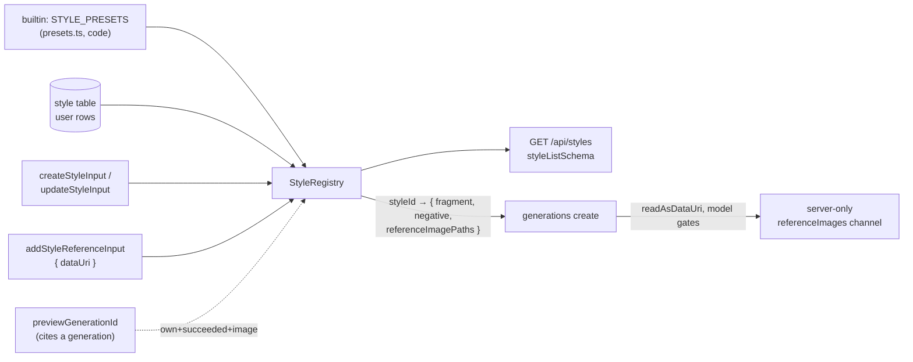

# style.ts — AI component doc

> AI-facing sidecar for `style.ts`. Created 2026-07-31. Keep this in sync with the code on every change.

## Purpose
Wire contracts for the **user-built style entity** (ADR `docs/wiki/decisions/style-studio.md`). A style
is a constructor — a name, two prompt fragments and up to three reference images — that the server
resolves by id at generation time, exactly the way a model resolves against the catalog. This file owns
the ROW half of the style axis; `presets.ts` owns the builtin half, and the registry answers with the
one shape defined here.

## What it does (for an AI reader)
- Responsibilities: define the shape of a style as the API returns it (builtin and user rows unified),
  the bounded inputs for creating and patching a user style, and the reference-image half of the
  package (cap constant, read shape, upload shape).
- Public API / exports:
  - Schemas: `styleKindSchema`, `styleSchema`, `createStyleInputSchema`, `updateStyleInputSchema`,
    `styleListSchema`, `styleReferenceImageSchema`, `addStyleReferenceInputSchema`.
  - Constant: `STYLE_MAX_REFERENCES = 3`.
  - Types: `StyleKind`, `Style`, `CreateStyleInput`, `UpdateStyleInput`, `StyleList`,
    `StyleReferenceImage`, `AddStyleReferenceInput`.
- Inputs → Outputs: request bodies for `POST/PATCH /api/styles(/:id)` and
  `POST /api/styles/:id/references` → validated input; `GET /api/styles` → `{ items: Style[] }` where
  each item is a builtin OR one of the caller's own rows.
- Side effects: none. Pure schemas.

## Dependencies
- Imports / depends on: `zod`.
- Used by: `packages/contracts/src/index.ts` (re-export); the API `modules/styles` service + routes;
  the web Styles module and every style picker once they move off the static table.

## Diagram

## Key decisions / gotchas
- **Two sources, one shape.** `builtin: boolean` is the only thing that distinguishes a shipped style
  from a user's row in the list. Pickers render both identically; the flag drives the badge and the
  "you cannot edit this" refusal.
- **Fragments are EXPOSED on both sides, deliberately.** A builtin's fragment already ships in the SPA
  bundle, and the whole point of the Style Studio is that a user can read one and build a better one.
  What is never exposed is anyone ELSE's row — the list is builtin + own, never a public catalog
  (shared/public styles are explicitly out of scope for the MVP).
- **`createdAt`/`updatedAt` are nullable *because builtins have no row*.** The nullability is
  information: it tells a client "this one is code, it has no history and no owner".
- **`kind` is the extension seam** (ADR D2). MVP has exactly one value, `'prompt'`. `'lora'` and
  `'reference'` are meant to arrive as a new enum value plus keys in the row's `config_json`, so
  neither the table nor the wire changes shape to grow. `kind` is absent from the update input on
  purpose: changing a style's kind is a different constructor, not an edit.
- **`recommendedModelId` is nullable in the patch, not merely optional.** An optional-only field could
  set a recommendation but never clear one.
- **`previewUrl` is resolved, not stored.** The row stores `preview_generation_id` and CITES the
  generation (canvas-mode D1 — cite, never own); the DTO carries the resolved `/media/…` path. A
  preview that was deleted, failed, or never belonged to the caller reads `null` — resolution
  degrades, it never throws and never leaks.
- **A style is a PACKAGE, not a choice** (amendment A1). `referenceImages` and the fragments coexist on
  one row and `kind` stays `'prompt'` — the images are a capability of the existing constructor, not a
  new kind. That is what keeps every style id already stored in a film/shot/template valid.
- **`referenceImages` is an ARRAY, never null**, like `shotSchema.referenceImages`: a row that predates
  the column, and every builtin (which has no row at all), reads `[]`. No picker null-checks first.
- **The read field is `url`, the stored JSON key is `path`.** Deliberate: the value is consumed as an
  `` in the constructor's thumbnail strip, so it is named what it is used as. The column
  (`style.reference_images_json`) mirrors `shot.reference_images_json` exactly — `[{ id, path }]`.
- **`STYLE_MAX_REFERENCES = 3`, not 5 like a shot.** A style is AMBIENT: it rides along with whatever
  the shot already tags, and on a model that accepts two references a bigger cap would only ever be
  trimmed away. One constant so the UI counter and the server refusal cannot drift.
- **`addStyleReferenceInputSchema` is byte-for-byte the shot's rule** (raster data URI, ≤14MB, svg
  refused). Wire-level svg refusal is defence in depth, not a replacement: `saveDataUri` re-guards the
  disk on the server side.
- Bounds (name ≤60, fragment ≤500, negative ≤300) are declared once as private consts and shared by
  create and update, so a patch can never be a way around them.
- EN wording is asked for in UI copy, not enforced here: models read English far better, but
  rejecting Cyrillic would refuse a fragment that actually works.

## Commits
- _no commit yet_
