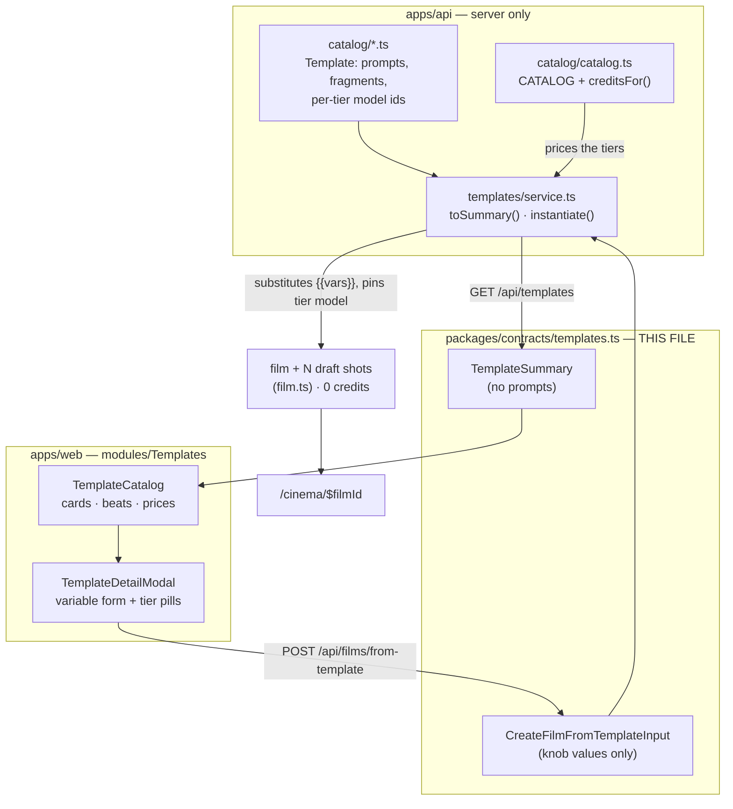

# templates.ts — AI component doc

> AI-facing sidecar for `templates.ts`. Created 2026-07-11. Keep this in sync with the code on every change.

## Purpose

Wire contracts for the **Template Catalog** — the `/templates` gallery and the
"create a film from this template" call. A Template is a pre-authored film: eight
beats of a viral short-form format, each with a finished prompt, a camera/style
preset, a duration, an on-screen title and a spoken line. The user picks one,
turns two or three knobs ("who cheats on whom"), and lands in the Cinema editor
with a timeline already built.

ADR: `docs/wiki/decisions/template-catalog.md`

## What it does (for an AI reader)

**The single most important fact: this file does NOT contain the templates.** It
contains the *pitch* for a template and the *request* to instantiate one.

| Lives where | What |
|---|---|
| `apps/api/src/modules/templates/catalog/*.ts` | The real `Template` — prompt text, the English fragment each select option expands to, per-tier model ids. **Server-only.** |
| **this file** | `TemplateSummary` (what the gallery renders), `TemplateVariable` (the knobs), `CreateFilmFromTemplateInput` (the knob values). |

Prompt text never reaches the client as *template* data. It reaches it as
`shot.prompt` — after instantiation, editable, owned by the user. The split is
load-bearing: bundle size (the catalog is meant to grow to hundreds), the prompts
are the product, and it preserves the client-sends-ids / server-composes law from
`presets.ts`.

- **Responsibilities:** define the category enum, the tier enum, the variable
  (knob) shape, the beat sheet, the priced tier offer, the gallery DTO, and the
  instantiation request body.
- **Public API / exports:**

  | Export | Role |
  |---|---|
  | `templateCategorySchema` / `TemplateCategory` | `'brainrot'` — the gallery shelf. Enum so the rail's tabs stay exhaustive. |
  | `templateTierSchema` / `TemplateTier`, `TEMPLATE_TIERS` | `'draft' \| 'standard' \| 'premium'` — the price/quality knob, and the **only** thing that selects a model. |
  | `templateVariableOptionSchema` / `TemplateVariableOption` | `{ value, label }`. The English prompt fragment is deliberately **absent** — server-side only. |
  | `templateVariableSchema` / `TemplateVariable` | One `{{placeholder}}`. `kind: 'select' \| 'text'`. |
  | `templateBeatSchema` / `TemplateBeat` | One row of the beat sheet: `{ label, durationSeconds, generated }`. |
  | `templateTierOfferSchema` / `TemplateTierOffer` | `{ tier, modelId, modelName, credits, note }`. `credits` = total for the whole template at that tier. |
  | `templateSummarySchema` / `TemplateSummary` | The gallery DTO. |
  | `templateListSchema` / `TemplateList` | `GET /api/templates` response. |
  | `createFilmFromTemplateInputSchema` / `CreateFilmFromTemplateInput` | `POST /api/films/from-template` body. |

- **Inputs → Outputs:**

  ```
  GET  /api/templates
         → TemplateList { items: TemplateSummary[] }

  POST /api/films/from-template
         ← CreateFilmFromTemplateInput { templateId, tier, variables, title? }
         → FilmDetail { film, shots, audio }        (see film.ts)
  ```

- **Side effects: none.** This file is pure schema. The instantiation it
  describes creates a film + N *draft* shots and **charges nothing**.

## Dependencies

- **Imports:** `zod`, `./catalog` (`aspectRatioSchema`).
- **Used by:**
  - `packages/contracts/src/index.ts` (barrel `export *`)
  - `apps/api/src/modules/templates/{types,service,routes}.ts`
  - `apps/web/src/modules/Templates/*`

## Diagram



## Key decisions / gotchas

- **Every tier model must natively support every clip duration AND the template's
  aspect ratio.** If it doesn't, `composeShotClipInput` silently snaps an 8s beat
  to the nearest legal value — changing both the cut and the price behind the
  user's back. This is enforced by a contract test
  (`apps/api/src/modules/templates/templates.test.ts`), not by the type system.
  The three brainrot tiers (`pixverse-v6` / `wan-2-7` / `veo-3-1-fast`) were
  chosen precisely because all three do 8s at 9:16.
- **Applying a template is FREE.** Shots land as drafts (`generationId = null`).
  Credits are spent only when the user presses Generate on a shot. A one-click
  "spend 1120 credits" button would be a trap — and a lie, since the user hasn't
  seen the shots yet and will want to change one.
- **`credits` on a tier offer is computed server-side from the live catalog**, never
  authored. It cannot drift away from what `POST /api/generations` will actually
  charge.
- **`previewUrl` is nullable and currently null.** The gallery renders a
  typographic card when it's null rather than a grey box pretending to be a
  video. Fill it once we have actually rendered an example.
- **Free-text variables are never substituted into a visual prompt** — only into
  spoken lines and on-screen titles. Video models are markedly worse at non-English
  staging direction, and free text in a prompt is a hole we'd rather not have.
  Select values are validated against a closed set before they can reach a prompt.

## Commits

- _no commit yet_
