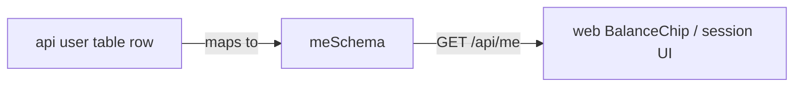

# user.ts — AI component doc

> AI-facing sidecar for `user.ts`. Created 2026-07-06. Keep this in sync with the code on every change.

## Purpose
Contract for `GET /api/me`: the signed-in user's identity plus the denormalized `creditsBalance`.

## What it does (for an AI reader)
- Responsibilities: define the `Me` shape (`id`, `email`, nullable `name`, integer `creditsBalance`).
- Public API / exports: `meSchema`, `Me`.
- Inputs → Outputs: unknown JSON → typed `Me`.
- Side effects: none (pure schema).

## Dependencies
- Imports / depends on: `zod`.
- Used by: `apps/api` `modules/users/routes.ts` (response), `apps/web` `useMe()` query + Credits `BalanceChip`.

## Diagram

## Key decisions / gotchas
- `creditsBalance` is the denormalized column on the user row, mutated only inside the same DB transaction as ledger writes — one cheap query for the header chip instead of aggregating the ledger.

## Commits
- _no commit yet_
