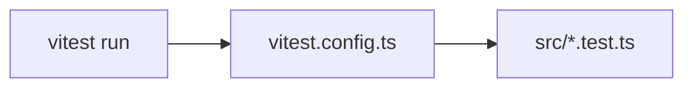

# vitest.config.ts — AI component doc

> AI-facing sidecar for `vitest.config.ts`. Created 2026-07-06. Keep this in sync with the code on every change.

## Purpose
Vitest configuration for `@opencreate/contracts`. Deliberately empty defaults: schema tests are pure Node/TS, so no environment, setup files, or plugins are needed.

## What it does (for an AI reader)
- Responsibilities: makes `vitest run` (the package `test` script) discover `src/*.test.ts` with default settings.
- Public API / exports / props / endpoints: default export of `defineConfig({})`.
- Inputs → Outputs: no inputs; Vitest reads this file at startup and applies default config.
- Side effects (I/O, network, state): none.

## Dependencies
- Imports / depends on: `vitest/config` (`defineConfig`).
- Used by: `pnpm --filter @opencreate/contracts test`.

## Diagram

## Key decisions / gotchas
- Kept empty on purpose (plan Task 2): contracts are runtime-agnostic Zod schemas, so jsdom/globals/setup are not required here (unlike apps/web).

## Commits
- 5c5d863 feat(contracts): shared zod schemas for catalog, generations, credits, user, errors
