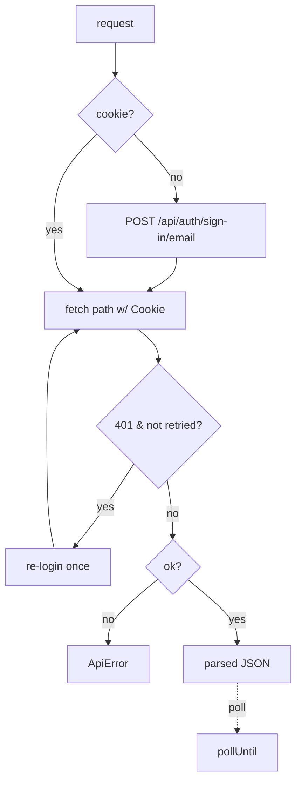

# api-client.ts — AI component doc

> AI-facing sidecar for `api-client.ts`. Created 2026-07-22. Keep this in sync with the code on every change.

## Purpose
The single seam to the openCreate REST API: handles better-auth cookie sessions, replays them, maps the error envelope, and polls the async job lifecycle. Nothing else in the package calls `fetch`.

## What it does (for an AI reader)
- Responsibilities: lazy sign-in (email+password → session cookie), cookie replay, one re-login+retry on 401, error-envelope → `ApiError`, async polling.
- Public API / exports:
  - `class ApiError(status, code, message)` — typed error from `{ error: { code, message } }`.
  - `class ApiClient(cfg, fetchImpl?)` with `request(method, path, body?)` and `pollUntil(path, isDone, {timeoutMs, intervalMs})`.
  - `type HttpMethod`, `type PollOptions`, `type FetchLike`.
- Inputs → Outputs: `(method, path, body)` → parsed JSON (or `null` for 204/no-body); throws `ApiError` on non-2xx.
- Side effects: network I/O to `${baseUrl}`; in-memory `cookie` cache.

## Dependencies
- Imports / depends on: `./config` (`McpConfig`), global `fetch` (injectable for tests).
- Used by: `server.ts` (tool dispatch), `tools.ts` poll specs (indirectly).

## Diagram

## Key decisions / gotchas
- 401 retry is capped at ONE — bad creds fail fast, never loop the auth rate-limit.
- Set-Cookie is reduced to `name=value` heads; server-only attributes are not echoed back.
- `origin: baseUrl` is sent because better-auth's CSRF wall checks Origin on auth POSTs — the base URL must be in `TRUSTED_ORIGINS`.
- `pollUntil` is how the API's 202 async lifecycle becomes one synchronous MCP call.

## Commits
- _no commit yet_
