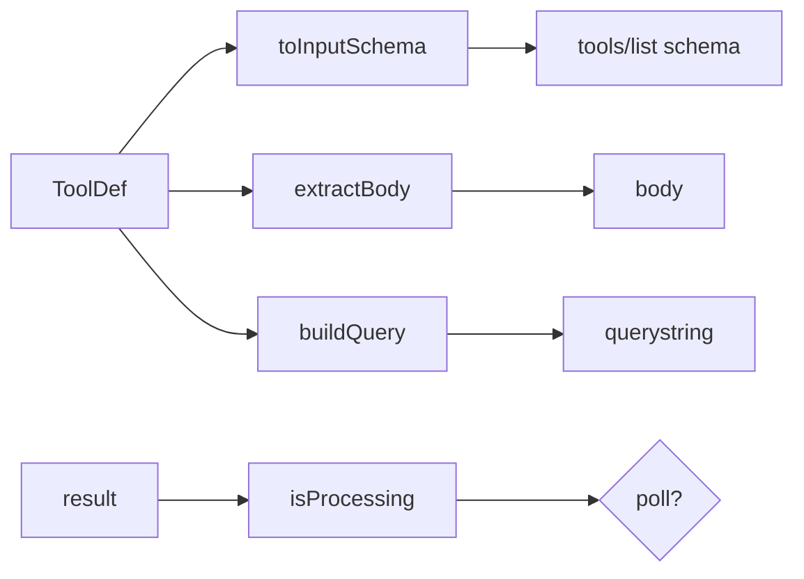

# registry.ts — AI component doc

> AI-facing sidecar for `registry.ts`. Created 2026-07-22. Keep this in sync with the code on every change.

## Purpose
The tool model (`ToolDef`) plus the pure, side-effect-free helpers that turn a declarative tool definition into an HTTP request and a JSON-Schema input. This is the DRY core that lets ~42 tools be a data table instead of 42 handlers.

## What it does (for an AI reader)
- Responsibilities: define `ToolDef`/`PollSpec`; build querystrings; split the body out of flat args; convert a contract zod schema into JSON Schema; detect the async "processing" state.
- Public API / exports:
  - `type ToolDef`, `type PollSpec`.
  - `buildQuery(query, args) => string` — `?a=1&b=2` (URLSearchParams-encoded).
  - `extractBody(tool, args) => Record` — args minus path/query/`wait`.
  - `toInputSchema(tool) => JSON Schema` — path+query params merged with `z.toJSONSchema(body)`, guarded.
  - `isProcessing(tool, result) => boolean`.
- Inputs → Outputs: `(ToolDef, args)` → request parts / JSON schema. No I/O.
- Side effects: none (pure).

## Dependencies
- Imports / depends on: `zod` (value, for `toJSONSchema`), `./api-client` (`HttpMethod` type).
- Used by: `tools.ts` (defines the table), `server.ts` (dispatch + tools/list), tests.

## Diagram

## Key decisions / gotchas
- Body fields are FLAT top-level input props alongside path params (Claude passes `{filmId, ...shotFields}`), split back out by `extractBody`.
- `toInputSchema` is guarded: if a schema can't convert, the tool still lists; the server's zod `safeParse` stays the real validation gate.
- `z.toJSONSchema(body, { io: 'input' })` — input-side schema (before defaults/transforms).

## Commits
- _no commit yet_
