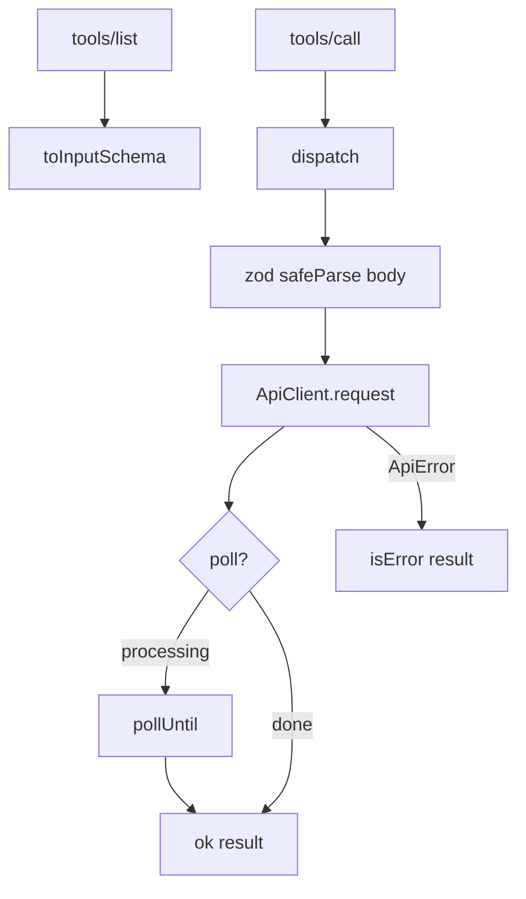

# server.ts — AI component doc

> AI-facing sidecar for `server.ts`. Created 2026-07-22. Keep this in sync with the code on every change.

## Purpose
Wires the declarative tool table onto an MCP `Server`: advertises tools (tools/list) and dispatches calls (tools/call), validating input and mapping the API to readable results.

## What it does (for an AI reader)
- Responsibilities: build the MCP server; validate path params + body; call the API via `ApiClient`; poll async jobs; shape success/error into MCP tool results.
- Public API / exports:
  - `type ToolResult`.
  - `dispatch(client, name, rawArgs) => Promise<ToolResult>` — the pure call path (exported for tests, no transport needed).
  - `buildServer(client) => Server` — a fully-wired low-level MCP server.
- Inputs → Outputs: `(tool name, args)` → `{ content:[{type:'text',text}], isError? }`.
- Side effects: network via `ApiClient`; none of its own.

## Dependencies
- Imports / depends on: `@modelcontextprotocol/sdk` (Server + request schemas), `./api-client`, `./registry`, `./tools`.
- Used by: `index.ts` (connects to stdio); `test/tools.test.ts` (drives `dispatch`).

## Diagram

## Key decisions / gotchas
- LOW-LEVEL `Server` + hand-built JSON Schema (not the zod-shape helper) → decoupled from the SDK's bundled zod version.
- Body validated with the SAME contract schema the API uses — rejected before any network call (no wasted request / provider money).
- Failures return `isError:true` (a normal protocol response Claude can read), not a transport fault. Unknown tool → `isError` too.
- Poll only when: tool has a `poll` spec, caller didn't pass `wait:false`, result is `processing`, and it has an `id`.

## Commits
- _no commit yet_
