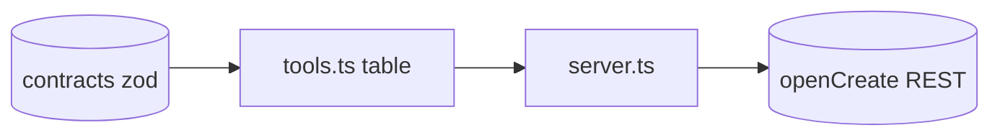

# tools.ts — AI component doc

> AI-facing sidecar for `tools.ts`. Created 2026-07-22. Keep this in sync with the code on every change.

## Purpose
The declarative table of all openCreate MCP tools — one `ToolDef` per real REST endpoint, each reusing the shared `@opencreate/contracts` zod schema for its body so tool input can never drift from what the API validates.

## What it does (for an AI reader)
- Responsibilities: enumerate ~44 tools across meta, generations, films, shots, audio/render, entities, 3D assets, model renders, prompt.
- Public API / exports: `const tools: ToolDef[]`.
- Inputs → Outputs: static data → consumed by `server.ts`.
- Side effects: none (pure data).
- Endpoints covered: `/api/me`, `/api/catalog`, `/api/credits/transactions`, `/api/generations` (+id), `/api/films` (+shots/audio/renders/references/storyboard/clip), `/api/films/from-template`, `/api/templates`, `/api/entities` (+id), `/api/assets3d` (+parts), `/api/models/:id/renders`, `/api/model-renders/:id`, `/api/prompt/enhance`.

## Dependencies
- Imports / depends on: `@opencreate/contracts` (body schemas), `./registry` (`ToolDef` type).
- Used by: `server.ts` (registers tools/list + tools/call).

## Diagram

## Key decisions / gotchas
- Async submit tools (`create_generation`, `generate_shot_clip`, `render_film`, `create_model_render`) carry a `poll` spec; `generate_shot_clip` returns a `Generation`, so it polls `/api/generations/:id`.
- Poll budgets: generations 120s@3s, renders 300s@4s. All statuses share the enum `processing|succeeded|failed`.
- NO tool for endpoints that don't exist (entity images/portraits have no standalone route) — coverage is faithful to `apps/api/.../routes.ts`.

## Commits
- _no commit yet_
