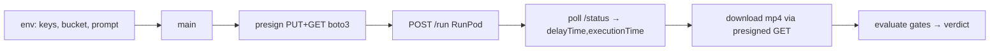

# run.py — AI component doc

> AI-facing sidecar for `run.py`. Created 2026-07-08. Keep this in sync with the code on every change.

## Purpose
Standalone measurement harness for the Wan 2.2 RunPod spike. It drives the worker end-to-end to capture the four numbers the ADR cost model cannot derive (cold `C`, warm `G`, real `$/clip`, and mp4 samples for quality), then auto-evaluates the go/no-go gates. Needs no build — only `requests` + `boto3`.

## What it does (for an AI reader)
- Responsibilities:
  - Mint a short-TTL presigned PUT (+ presigned GET for our own download) per clip via boto3 (`presign_pair`) — works for AWS S3 and Cloudflare R2.
  - Submit jobs to a RunPod serverless endpoint (`submit`) and poll `/status` with retry/timeout (`poll`).
  - Read `delayTime`→C and `executionTime`→G; compute `warm_cost = G×rate` and `full_cost = (C+G)×rate`.
  - Download each mp4 and run a contract self-check (`output.assetUrl == objectKey`).
  - Evaluate ADR gates and print a verdict (`verdict`): GO / ESCALATE→H100 / NO-GO / INCONCLUSIVE.
- Public API / entry: `main()` (run as a script). Test plan: cold-t2v → warm-t2v (back-to-back), optional warm-i2v, optional h100-t2v.
- Inputs → Outputs:
  - IN (env): `RUNPOD_API_KEY`, `RUNPOD_ENDPOINT_ID`(4090), `RUNPOD_ENDPOINT_ID_H100?`, `S3_ENDPOINT_URL?`, `S3_REGION?`, `S3_ACCESS_KEY_ID`, `S3_SECRET_ACCESS_KEY`, `S3_BUCKET`, `S3_PUBLIC_BASE_URL?`, `RUNPOD_GPU_RATE_PER_SEC_4090?`, `RUNPOD_GPU_RATE_PER_SEC_H100?`, `SPIKE_PROMPT/WIDTH/HEIGHT/DURATION/SEED?`, `I2V_IMAGE_PATH?`|`I2V_IMAGE_URL?`.
  - Job input sent (CONTRACT, matches worker/handler.py): `{prompt,width,height,duration,seed,inputImage?,putUrl,objectKey}`.
  - Job output read: `{assetUrl(==objectKey),nsfw,genSeconds,...}`.
  - OUT: `measure/out/*.mp4`, a results table, and a printed verdict.
- Side effects: reads env; boto3 presign (no upload by the client itself); N RunPod submits + polls; writes mp4s under `measure/out/`. Presigned URLs are redacted (`_redact`) in any error line.

## Dependencies
- Imports / depends on: `boto3` (presign), `requests` (RunPod API + downloads); the RunPod v2 REST API; an S3/R2 bucket. Contract-coupled to `../worker/handler.py`.
- Used by: the operator running the spike (README steps e–f).

## Diagram

## Key decisions / gotchas
- `delayTime`/`executionTime` are milliseconds → divided by 1000.
- `full_cost` (cold-inclusive) is used as the conservative $/clip; `warm_cost` is reported too.
- Default rate is the ADR 4090 COMMUNITY rate; the script prints a NOTE to override with the real serverless FLEX rate or the cost gate is optimistic.
- Quality is inherently MANUAL — the script cannot judge it; GO is always "pending manual quality ≥ Seedance".
- OOM in a 4090 job flips the verdict toward ESCALATE→H100 per the ADR.

## Commits
- spike(wan): runpod wan 2.2 feasibility worker + measurement harness
