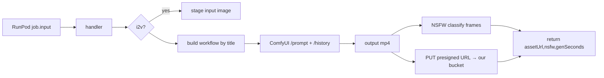

# handler.py — AI component doc

> AI-facing sidecar for `handler.py`. Created 2026-07-08. Keep this in sync with the code on every change.

## Purpose
RunPod serverless handler for the Wan 2.2 feasibility spike. It runs a headless ComfyUI process, drives a Wan 2.2 A14B (FP8) text-to-video / image-to-video workflow, screens the output for NSFW content, and delivers the mp4 to our object store via a per-job presigned PUT. It exists to measure real cold/warm/cost/quality numbers for the ADR — it is spike code, not the production VideoProvider.

## What it does (for an AI reader)
- Responsibilities:
  - Boot ComfyUI once per container (`_start_comfy`) and reuse it across warm jobs.
  - Template a workflow JSON by NODE TITLE (`PROMPT_POSITIVE`, `PROMPT_NEGATIVE`, `LATENT_DIMS`, `INPUT_IMAGE`, `OUTPUT_VIDEO`) so the graph can be swapped without touching code; seed is injected on every node with a `seed`/`noise_seed` input.
  - Run generation via ComfyUI HTTP API (`/prompt` → poll `/history/{id}`) and time it as `genSeconds`.
  - Classify NSFW on evenly-sampled output frames (default-deny: any read/classifier failure → `nsfw=True`).
  - Upload the mp4 with an HTTP PUT to the presigned `putUrl` (worker holds no long-lived bucket creds).
- Public API / exports / endpoints: `handler(job)` registered via `runpod.serverless.start`. Not an HTTP server itself — RunPod invokes `handler`.
- Inputs → Outputs (the CONTRACT — see the module docstring; `measure/run.py` is the consumer):
  - IN `job["input"]`: `prompt`(req), `putUrl`(req), `objectKey`(req), `negativePrompt?`, `width?=1280`, `height?=720`, `duration?=5`, `fps?=16`, `seed?`, `steps?=20`, `inputImage?`(data-uri|https → i2v).
  - OUT: `{assetUrl(=objectKey), nsfw, genSeconds, width, height, numFrames, seed}`. On failure: raise → RunPod job FAILED.
- Side effects: spawns a ComfyUI subprocess; writes staged input images to ComfyUI input dir; reads generated mp4 from output dir; one outbound HTTP PUT to the presigned URL; loads an NSFW model (baked into the image). Presigned URLs are redacted (`_redact`) before any log line.

## Dependencies
- Imports / depends on: `runpod` SDK, `requests`, `transformers`+`torch` (NSFW ViT), `imageio`/`pyav`, `Pillow`; a local ComfyUI install at `COMFY_DIR`; `extra_model_paths.yaml` pointing at the mounted network volume; `workflows/wan22_t2v.json` and `workflows/wan22_i2v.json`.
- Used by: RunPod Serverless runtime (endpoint built from `worker/Dockerfile`). The contract is consumed by `../measure/run.py`.

## Diagram

## Key decisions / gotchas
- ComfyUI over diffusers: the Wan 2.2 optimization stack (FP8, SageAttention, TeaCache) is ComfyUI-node-first in mid-2026.
- Custom handler over stock `worker-comfyui`: stock does neither NSFW screening nor presigned-PUT delivery.
- Title-based injection makes the handler resilient to the exact Wan node graph — the operator can drop in ComfyUI's shipped Wan 2.2 template and only needs to set the five titles.
- Cold start `C` and warm exec `G` are NOT timed here — RunPod returns `delayTime`/`executionTime`. `genSeconds` is only a cross-check.
- NSFW is default-deny: failure to read frames or classify returns `nsfw=True` so the downstream §9.4 gate blocks rather than leaks.

## Commits
- spike(wan): runpod wan 2.2 feasibility worker + measurement harness
